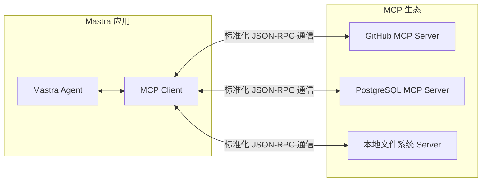

# 模型上下文协议 (MCP)

在过去，如果我们想让一个 AI Agent 能够读取 GitHub 代码库、查询 Notion 文档、或者操作本地文件系统，我们必须为每一个外部服务从零开始编写定制化的集成代码。这导致了严重的生态碎片化。

由 Anthropic 提出的 **模型上下文协议 (Model Context Protocol, MCP)** 旨在解决这个问题。它可以被理解为“AI Agent 的 USB 接口”。

## 🔌 什么是 MCP？

MCP 采用 Client-Server 架构：

- **MCP Server**：包装特定的外部资源（如本地文件、GitHub、Notion）并暴露标准化的工具（Tools）、资源（Resources）和提示词模板（Prompts）。
- **MCP Client**：大模型应用（如 Mastra Agent, Cursor, Claude Desktop）。只需连接到 Server，就能自动发现并调用这些能力。



使用 MCP，Mastra Agent 可以无缝接入现存的庞大 MCP 开源生态，瞬间获得与几百种 SaaS 工具和本地系统交互的能力。

---

## 🛠️ Mastra 中的 MCP 客户端

Mastra 提供了原生的一流 MCP 客户端支持。你可以轻松连接任何兼容的 MCP 服务器。

```typescript
import { Agent } from '@mastra/core/agent';
import { McpClient } from '@mastra/mcp';

// 1. 创建 MCP 客户端并连接到外部服务器 (例如: 一个天气服务)
const weatherClient = new McpClient({
  server: {
    command: 'npx',
    args: ['-y', '@weather-mcp/server'] // 运行外部服务的命令
  }
});
await weatherClient.connect();

// 2. 将 MCP 客户端挂载到 Agent 上
const agent = new Agent({
  name: 'WeatherAgent',
  instructions: '你可以通过 MCP 工具查询天气。',
  model: openai('gpt-4o'),
  // 核心特性：自动暴露服务器上的所有工具
  mcpClients: {
    weather: weatherClient 
  }
});
```

当 Agent 启动时，它会自动向 MCP Server 请求所有可用的工具，并将这些工具的 Schema 注册到大模型。这就跟你在 Demo 02 中手动编写 `createTool` 的效果一模一样，只不过这一切都是全自动的！

---

## 🌐 Mastra 中的 MCP 服务器

不仅可以做客户端，Mastra 也能将**你自己的 Agent、Tools 和 Workflows** 暴露为 MCP Server，供其他应用（如 Claude Desktop）调用。

```typescript
import { McpServer } from '@mastra/mcp';

const server = new McpServer();

// 暴露你自定义的工具
server.registerTool(myCustomTool);
// 暴露你的 Agent
server.registerAgent(myAgent);
// 暴露你的 Workflow
server.registerWorkflow(myWorkflow);

// 启动服务器 (使用 stdio 或 SSE 传输)
server.start();
```

通过这种方式，你可以用 Mastra 开发复杂的业务逻辑，然后轻松将其注入到主流的 AI IDE 或聊天客户端中。

---
**下一步**：前往 `examples/demos/08-mcp.ts` 运行 Demo，体验这种即插即用的 AI 扩展能力。
