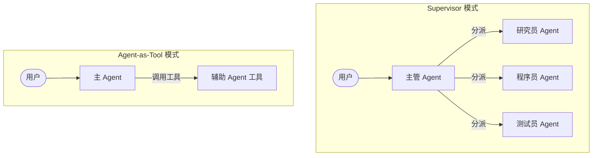

# 多智能体协作 (Multi-Agent)

当任务复杂度超过单个大模型的能力上限时，将任务拆分给多个专注于特定领域的**专业 Agent** 是目前的最佳实践。

Mastra 支持多种形式的多智能体网络拓扑结构。

## 🕸️ 常见协作模式



### 1. Supervisor (主管模式)
这种模式下，有一个中心化的“主管 (Supervisor)”。它本身通常不执行具体任务，而是负责理解用户的总体目标，拆解任务，并将子任务分发给下属的专业 Agent。最后，它汇总所有下属的报告，生成最终回复。

### 2. Agent-as-Tool (代理即工具模式)
在 Mastra 中，任何 Agent 都可以被封装成一个 Tool。这意味着一个 Agent 可以像调用普通函数（比如查天气）一样，去调用另一个 Agent。

### 3. Council (委员会模式)
针对复杂的决策问题，让多个持有不同“观点”（Prompt）的 Agent 针对同一个问题进行讨论，最后由一个总结 Agent 拍板。这能有效降低大模型的幻觉和偏见。

---

## 🛠️ 在 Mastra 中实现 Agent-as-Tool

在 Mastra 中，将一个 Agent 变成另一个 Agent 的工具非常简单。这种组合能力是无限的。

```typescript
import { Agent } from '@mastra/core/agent';
import { createTool } from '@mastra/core/tools';
import { z } from 'zod';

// 1. 定义一个专业的子 Agent
const researcherAgent = new Agent({
  name: '研究员',
  instructions: '你是一个深度研究员，擅长从大量文本中总结关键信息。',
  model: openai('gpt-4o'),
});

// 2. 将子 Agent 包装成一个 Tool
const researchTool = createTool({
  id: 'deep-research',
  description: '当需要对某个复杂话题进行深度总结时，调用此工具。',
  inputSchema: z.object({ topic: z.string() }),
  execute: async ({ context }) => {
    // 在工具内部调用另一个 Agent
    const result = await researcherAgent.generate(`请研究并总结：${context.topic}`);
    return result.text;
  }
});

// 3. 将工具交给主 Agent
const mainAgent = new Agent({
  name: '主理人',
  instructions: '你负责与用户沟通。如果遇到需要深度研究的话题，请调用研究工具。',
  model: openai('gpt-4o'),
  tools: { researchTool }
});
```

---

## 💡 为什么不把所有指令写进一个 Prompt？

你可能会问：*为什么不直接写一个超长的 System Prompt，告诉一个大模型“你既是研究员，又是程序员，又是主管”？*

1. **Token 限制与注意力涣散 (Lost in the Middle)**：Prompt 越长，大模型对指令的遵循度越低，容易忘记前面的要求。
2. **工具冲突**：如果一个 Agent 挂载了 50 个工具，它在选择工具时出错的概率会大大增加。专业的子 Agent 只需要挂载它自己需要的 3 个工具。
3. **上下文隔离**：写代码的 Agent 不需要看到研究员搜索文献的几万字中间过程，它只需要看到最终总结。这就节省了大量的上下文空间和 API 费用。

---
**下一步**：前往 `examples/demos/07-multi-agent.ts` 运行 Demo，体验多个智能体是如何各司其职并协同工作的！
