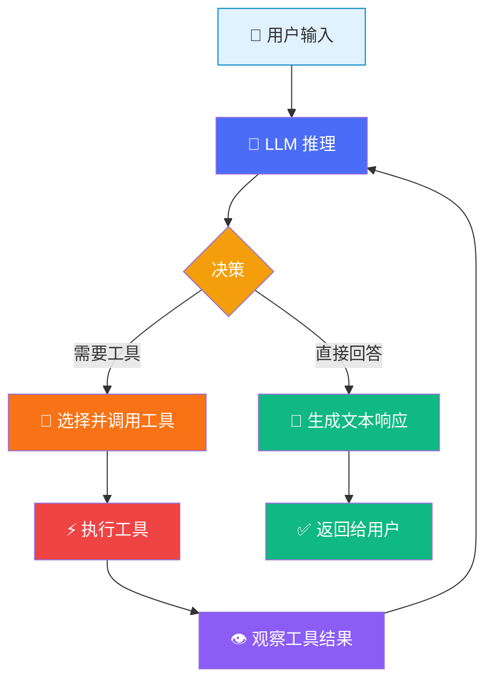

# Agent 基础

## 什么是 Agent？

在 Mastra 中，**Agent**（智能体）是一个由 LLM 驱动的自主实体。它不仅能对话，更关键的是——它能**自主决策**。

> [!NOTE]
> 传统的 LLM 调用是"你问一次，它答一次"。而 Agent 模式下，LLM 可以**自行决定**是直接回答，还是先调用工具获取信息，然后再回答。这种自主决策能力，就是 Agent 和简单 LLM 调用的根本区别。

## Agent 的构成要素

一个 Mastra Agent 由三个核心要素组成：

```typescript
import { Agent } from "@mastra/core/agent";
import { openai } from "@ai-sdk/openai";

const agent = new Agent({
  name: "research-assistant",        // 名称：Agent 的身份标识
  instructions: `你是一名研究助手。    // 指令：Agent 的行为准则（system prompt）
    你擅长检索和总结信息。
    回答时请注明信息来源。`,
  model: openai("gpt-4o"),           // 模型：Agent 的"大脑"
});
```

| 要素 | 作用 | 类比 |
|------|------|------|
| `name` | 唯一标识符，用于日志和调试 | 员工工号 |
| `instructions` | 定义 Agent 的角色、行为和约束 | 岗位职责说明 |
| `model` | 指定使用哪个 LLM 进行推理 | 大脑 |

### `instructions` 的重要性

`instructions` 本质上就是 system prompt。它决定了 Agent 的"人格"和行为边界：

```typescript
// ❌ 模糊的 instructions
const vagueAgent = new Agent({
  name: "vague",
  instructions: "帮助用户。",
  model: openai("gpt-4o"),
});

// ✅ 明确的 instructions
const preciseAgent = new Agent({
  name: "code-reviewer",
  instructions: `你是一名高级 TypeScript 代码审查员。
    审查规则：
    1. 检查类型安全性
    2. 检查错误处理是否完整
    3. 检查是否遵循 SOLID 原则
    4. 给出改进建议时附带代码示例
    输出格式：先总结问题数量，再逐一分析。`,
  model: openai("gpt-4o"),
});
```

## Agent 类源码解析

Mastra 的 `Agent` 类来自 `@mastra/core/agent`。让我们看看它的核心结构：

```typescript
// 简化的 Agent 类核心结构
class Agent {
  name: string;
  instructions: string | (() => string | Promise<string>);
  model: LanguageModel;
  tools?: Record<string, Tool>;
  memory?: Memory;

  async generate(
    messages: string | CoreMessage[],
    options?: AgentGenerateOptions
  ): Promise<AgentGenerateResult> {
    // 1. 组装 system prompt
    // 2. 格式化用户消息
    // 3. 调用 LLM
    // 4. 处理工具调用（如有）
    // 5. 返回结果
  }

  async stream(
    messages: string | CoreMessage[],
    options?: AgentStreamOptions
  ): Promise<AgentStreamResult> {
    // 与 generate 类似，但返回流式结果
  }
}
```

> [!TIP]
> `instructions` 不仅可以是字符串，还可以是一个**函数**。这意味着你可以动态生成指令——比如根据当前时间、用户身份或上下文来调整 Agent 的行为。

## `.generate()` 同步调用

`.generate()` 是最基本的调用方式——发送消息，等待完整回复：

```typescript
const agent = new Agent({
  name: "translator",
  instructions: "你是一个中英翻译助手。用户说中文时翻译成英文，说英文时翻译成中文。",
  model: openai("gpt-4o"),
});

// 简单字符串输入
const result = await agent.generate("今天天气真不错");
console.log(result.text);
// 输出: "The weather is really nice today"

// 结构化消息输入
const result2 = await agent.generate([
  { role: "user", content: "Hello, how are you?" },
]);
console.log(result2.text);
// 输出: "你好，你好吗？"
```

### 返回值结构

```typescript
interface AgentGenerateResult {
  text: string;                // LLM 生成的文本
  toolCalls?: ToolCall[];      // 工具调用记录（如有）
  toolResults?: ToolResult[];  // 工具执行结果（如有）
  usage: {
    promptTokens: number;      // 输入 token 数
    completionTokens: number;  // 输出 token 数
    totalTokens: number;       // 总 token 数
  };
}
```

## `.stream()` 流式调用

当你需要实时展示 LLM 生成过程（如聊天界面）时，使用 `.stream()`：

```typescript
const agent = new Agent({
  name: "storyteller",
  instructions: "你是一个故事讲述者，用生动的语言讲述故事。",
  model: openai("gpt-4o"),
});

const stream = await agent.stream("给我讲一个关于勇敢骑士的故事");

// 逐块读取流式输出
for await (const chunk of stream.textStream) {
  process.stdout.write(chunk); // 实时输出，不换行
}
console.log(); // 最后换行
```

### `.generate()` vs `.stream()` 对比

| 特性 | `.generate()` | `.stream()` |
|------|--------------|-------------|
| 返回方式 | 等待完整结果 | 逐块流式返回 |
| 首字延迟 | 高（等全部生成完） | 低（生成即返回） |
| 适用场景 | 后端处理、批量任务 | 聊天 UI、实时展示 |
| 内存占用 | 一次性加载 | 流式读取，内存友好 |

## 模型切换

得益于 Vercel AI SDK 的统一接口，切换 LLM 提供商只需改一行代码：

::: code-group

```typescript [OpenAI]
import { openai } from "@ai-sdk/openai";

const agent = new Agent({
  name: "assistant",
  instructions: "你是一个有帮助的助手。",
  model: openai("gpt-4o"),
});
```

```typescript [Anthropic]
import { anthropic } from "@ai-sdk/anthropic";

const agent = new Agent({
  name: "assistant",
  instructions: "你是一个有帮助的助手。",
  model: anthropic("claude-sonnet-4-20250514"),
});
```

```typescript [Google Gemini]
import { google } from "@ai-sdk/google";

const agent = new Agent({
  name: "assistant",
  instructions: "你是一个有帮助的助手。",
  model: google("gemini-2.0-flash"),
});
```

:::

> [!WARNING]
> 不同模型的能力不同。例如，工具调用能力在 GPT-4o 和 Claude Sonnet 上表现最佳。切换模型后建议运行 Evals 评估效果差异。

## Agent Loop：智能体循环

Agent Loop 是理解 Mastra Agent 工作原理的**最关键概念**。它解释了 Agent 如何在"推理"和"行动"之间循环：



### 循环过程详解

1. **用户输入**：用户发送一条消息
2. **LLM 推理**：Agent 将 instructions + 对话历史 + 用户消息发给 LLM
3. **决策**：LLM 判断是否需要使用工具
   - 如果**不需要工具**：直接生成文本回复 → 返回给用户
   - 如果**需要工具**：选择工具并生成调用参数
4. **执行工具**：Mastra 执行被选中的工具
5. **观察结果**：工具的执行结果被追加到对话历史中
6. **回到步骤 2**：LLM 基于工具结果继续推理

> [!IMPORTANT]
> 关键洞察：**是 LLM 自主决定是否使用工具，而不是代码逻辑决定的**。Agent 只是提供了一个"环境"——包含可用工具的列表和它们的描述。LLM 根据用户的问题和工具的描述，自主做出判断。

### 循环次数

默认情况下，Agent Loop 有最大循环次数限制（`maxSteps`），防止无限循环：

```typescript
const result = await agent.generate("帮我查询天气", {
  maxSteps: 5, // 最多循环 5 次（默认值通常足够）
});
```

## 完整代码示例

以下是 Demo 01 的完整代码：

```typescript
// demos/01-agent-basics/index.ts
import { Agent } from "@mastra/core/agent";
import { getModel } from "../../src/mock/mock-model";

async function main() {
  // 创建 Agent
  const agent = new Agent({
    name: "my-assistant",
    instructions: `你是一个有帮助的 AI 助手。
      你的特点是回答简洁、准确、有条理。
      如果不确定答案，请诚实地说"我不确定"。`,
    model: getModel(), // 支持 Mock 模式
  });

  console.log(`🤖 Agent: ${agent.name}`);
  console.log(`📝 Instructions: ${agent.instructions}\n`);

  // 测试 1: 基本对话
  console.log('--- 测试 1: 基本对话 ---');
  const result1 = await agent.generate("你好，请用一句话介绍你自己。");
  console.log(`✅ 回复: ${result1.text}\n`);

  // 测试 2: 流式输出
  console.log('--- 测试 2: 流式输出 ---');
  const stream = await agent.stream("请列出 TypeScript 的三个优点。");
  process.stdout.write("✅ 回复: ");
  for await (const chunk of stream.textStream) {
    process.stdout.write(chunk);
  }
  console.log("\n");

  // 测试 3: 多轮对话
  console.log('--- 测试 3: 多轮对话 ---');
  const result3 = await agent.generate([
    { role: "user", content: "我叫小明" },
    { role: "assistant", content: "你好小明！很高兴认识你。" },
    { role: "user", content: "你还记得我的名字吗？" },
  ]);
  console.log(`✅ 回复: ${result3.text}\n`);

  console.log("--- Demo 01 完成 ---");
}

main().catch(console.error);
```

## 核心洞察

::: info Agent 是环境提供者
Mastra 的 Agent 本质上是一个**环境提供者**，而不是一个"指令执行器"。Agent 提供：
- 身份（name + instructions）
- 能力（tools）
- 记忆（memory）

而**所有的决策都由 LLM 自主完成**。这就是 Agent 与传统编程范式的根本区别——你不是在编写 if/else 控制逻辑，而是在搭建一个让 LLM 自主决策的环境。
:::

## 下一步

现在你理解了 Agent 的基础。但一个只会"说话"的 Agent 用处有限。下一章我们将学习如何给 Agent 装上"手和脚"——[工具调用](./tool-calling.md)，让它能够与外部世界交互。
