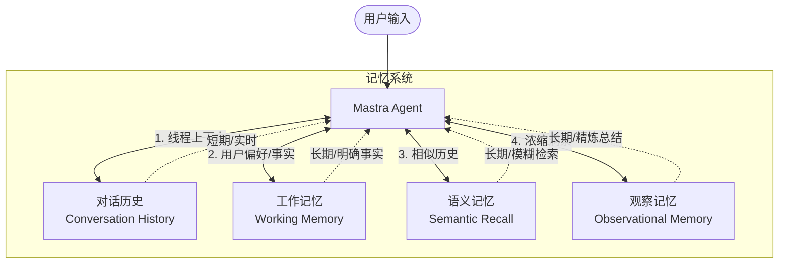

# 记忆系统 — 让 Agent 拥有记忆

Agent 默认是无状态的（Stateless），这意味着它在每次处理请求时，都不会记得之前的对话内容。对于复杂任务和长期交互，这显然是不够的。

Mastra 提供了一个强大的**四层记忆架构**，让 Agent 能够像人类一样拥有不同生命周期和用途的记忆。

## 🧠 四层记忆架构

Mastra 的记忆系统不仅限于简单的“历史记录”，它将记忆分为四个维度：



### 1. 对话历史 (Conversation History)
- **用途**：短期记忆，用于维持当前对话上下文。
- **机制**：存储当前 Thread（线程）中最近的 N 条消息（如 `lastMessages: 20`）。
- **特点**：滑动窗口，旧消息会被丢弃以防止超出 Token 限制。

### 2. 工作记忆 (Working Memory)
- **用途**：长期结构的“便签”，存储明确的事实和偏好。
- **机制**：通常以 Markdown 或 Zod Schema 形式存储。
- **特点**：Agent 可以显式地读取和更新这些事实（例如：“用户喜欢用 Python”、“用户的名字叫张三”）。

### 3. 语义记忆 (Semantic Recall)
- **用途**：长期模糊检索。
- **机制**：将历史对话转化为向量嵌入（Embeddings）存入向量数据库。
- **特点**：当用户提到某个话题时，通过语义相似度搜索历史中相关的片段，注入当前上下文。

### 4. 观察记忆 (Observational Memory)
- **用途**：高级上下文压缩。
- **机制**：由后台的 **Observer Agent** 将冗长的原始历史浓缩为带有时间戳和优先级的“观察”。**Reflector Agent** 定期合并重复项并丢弃低优先级细节。
- **特点**：在长期对话中保持极其稳定的上下文窗口，避免 Token 爆炸。

---

## 🧵 Thread（对话线程）

记忆是按 Thread 隔离的。每个 Thread 代表一次独立的对话（类似于 ChatGPT 中的一个聊天窗口）。

- **创建**：当你初始化对话时，可以指定或生成一个 `threadId`。
- **切换**：通过传入不同的 `threadId`，Agent 可以在不同的对话上下文中切换。

---

## 💻 配置示例

在 Mastra 中配置记忆系统非常直观：

```typescript
import { Agent } from '@mastra/core/agent';
import { Memory } from '@mastra/memory';
import { PgStorage } from '@mastra/pg-storage'; // 以 PostgreSQL 为例

// 1. 初始化存储后端
const storage = new PgStorage({ connectionString: process.env.DATABASE_URL });

// 2. 配置 Memory 实例
const memory = new Memory({
  storage,
  options: {
    lastMessages: 10, // 保留最近 10 条消息
    semanticRecall: {
      topK: 3, // 检索最相关的 3 条历史
    },
    workingMemory: {
      enabled: true,
      // 可以提供一个 Zod Schema 来约束工作记忆的格式
    }
  },
});

// 3. 将 Memory 附加给 Agent
const agent = new Agent({
  name: 'MemoryAgent',
  instructions: '你是一个拥有记忆的助手。',
  model: openai('gpt-4o'),
  memory, 
});

// 使用：传入 threadId
const response = await agent.generate('你好，我叫李四', {
  threadId: 'thread-123' 
});
```

---

## 🗄️ 存储后端

Mastra 的记忆系统支持多种存储后端，适应从本地开发到云端生产的多种场景：
- **PostgreSQL** (`@mastra/pg-storage`)
- **LibSQL / Turso** (`@mastra/libsql-storage`)
- **Upstash / Redis** (`@mastra/upstash-storage`)
- **本地/内存**（用于测试和 Demo）

---

## 🎯 最佳实践：何时用哪层记忆？

::: tip 💡 记忆选择指南
- **刚说的几句话** ➡️ 依赖 **对话历史**。
- **用户的身份、明确的规则、长期的偏好** ➡️ 写入 **工作记忆**。
- **几周前讨论过的某个 Bug 的细节** ➡️ 依赖 **语义记忆** 检索。
- **持续数月的开放式聊天** ➡️ 开启 **观察记忆** 进行智能压缩。
:::

---
**下一步**：前往 `examples/demos/04-memory.ts` 运行 Demo，亲身体验多层记忆是如何从底层构建起来的！
