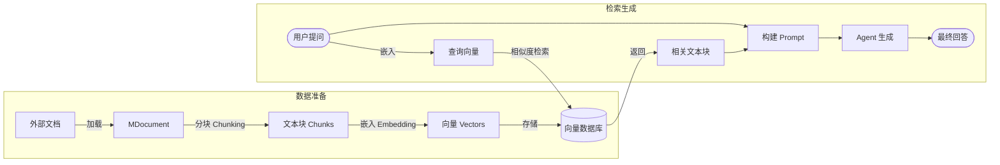

# RAG 检索增强生成

LLM 存在两个天然限制：**知识截止**（不知道训练数据之后发生的事）和**幻觉**（容易在不知道答案时胡编乱造）。对于特定领域的企业数据，LLM 更是毫无所知。

**RAG (Retrieval-Augmented Generation)** 就是为了解决这些问题而生的。它允许 Agent 动态地从外部文档中搜索信息，并将这些信息作为上下文喂给 LLM。

## 🔄 RAG 全流程

Mastra 提供了一个端到端的 RAG 管道，涵盖了从文档解析到最终生成的每一个环节。



---

## 1. 文档处理与分块 (Chunking)

长文档无法直接放入 LLM 的上下文窗口，必须进行分块。Mastra 提供了多种分块策略：

| 策略 | 说明 | 适用场景 |
|------|------|----------|
| `recursive` | 递归分割（段落→句子→词） | 最常用，兼顾语义和长度 |
| `sentence` | 按句子边界（。！？）分割 | 适合短文本精细检索 |
| `token` | 按 Token 数量硬分割 | 严格控制上下文大小 |
| `markdown` / `html` | 识别标签层级分割 | 结构化文档 |
| `semantic` | 基于语义相似度合并句子 | 最智能，保持语义完整 |

**分块参数：**
- `chunkSize`: 每个块的最大长度。
- `chunkOverlap`: 块与块之间的重叠部分，防止句子被生硬切断丢失上下文。

```typescript
import { MDocument } from '@mastra/rag';

const doc = new MDocument({ text: '一段很长的文本...' });
const chunks = await doc.chunk({
  strategy: 'recursive',
  size: 512,
  overlap: 50,
});
```

---

## 2. 嵌入向量生成 (Embedding)

嵌入模型将文本映射为高维向量空间中的一个点。语义相近的文本，其向量距离越近。

Mastra 标准化了嵌入 API，支持多种模型：

```typescript
import { embed } from '@mastra/rag';
import { openai } from '@ai-sdk/openai';

const { embedding } = await embed({
  value: '什么是 Mastra？',
  model: openai.embedding('text-embedding-3-small'),
});
```

---

## 3. 向量数据库 (Vector DB)

生成的向量需要存储在专门的向量数据库中以便快速检索。Mastra 抽象了存储层，支持平滑切换：

- **PgVector** (`@mastra/pg-storage`)
- **Pinecone** (`@mastra/pinecone-storage`)
- **Qdrant** (`@mastra/qdrant-storage`)

---

## 4. 检索与上下文注入

当用户提问时，RAG 管道会：
1. 将问题转化为向量。
2. 在数据库中执行**相似度搜索**（Cosine Similarity）。
3. Mastra 还支持**混合搜索 (Hybrid Search)**，结合向量的语义搜索和传统的全文检索（BM25），提供更精准的结果。

检索到的文本会被提供给 Agent：

```typescript
// 在 Mastra 中，通常会将检索包装成一个 Tool
const searchKnowledgeTool = createTool({
  id: 'search-docs',
  description: '查询 Mastra 框架的技术文档',
  inputSchema: z.object({ query: z.string() }),
  execute: async ({ context }) => {
    // 1. 嵌入查询
    const { embedding } = await embed({ value: context.query, model });
    // 2. 检索数据库
    const results = await vectorStore.search(embedding, { topK: 3 });
    // 3. 返回文本
    return results.map(r => r.metadata.text).join('\n\n');
  }
});
```

---

::: warning ⚠️ 减少幻觉的最佳实践
仅仅提供检索结果是不够的，你需要在 Agent 的 `instructions` 中明确规定：
> "仅根据提供的参考资料回答问题。如果你在资料中找不到答案，请诚实地回答'不知道'，**绝不要**编造信息。"
:::

---
**下一步**：前往 `examples/demos/05-rag.ts` 运行 Demo，看看 Agent 是如何从外部文档库中寻找答案的！
