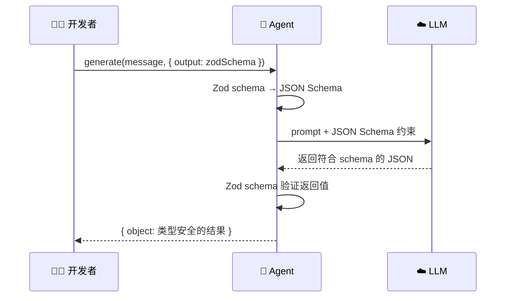
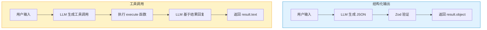

# 结构化输出

## 为什么需要结构化输出？

默认情况下，LLM 返回的是自由格式的文本。但在实际应用中，我们经常需要**可解析、类型安全**的结果：

```typescript
// ❌ 自由文本 —— 不可靠，难以解析
"这部电影评分 8.5 分，导演是克里斯托弗·诺兰，2023 年上映..."

// ✅ 结构化输出 —— 类型安全，直接使用
{
  title: "奥本海默",
  rating: 8.5,
  director: "克里斯托弗·诺兰",
  year: 2023,
  genres: ["传记", "历史", "剧情"]
}
```

> [!NOTE]
> 结构化输出和工具调用是两个不同的概念：
> - **工具调用**：扩展 Agent 的**能力**（让它能做新的事情）
> - **结构化输出**：约束 Agent 的**输出格式**（让它按要求返回数据）

## Zod Schema 作为输出契约

在 Mastra 中，使用 `structuredOutput` 选项 + Zod schema 来约束 LLM 的输出格式：

```typescript
import { Agent } from "@mastra/core/agent";
import { openai } from "@ai-sdk/openai";
import { z } from "zod";

const agent = new Agent({
  name: "extractor",
  instructions: "你是一个信息提取助手。从用户提供的文本中提取结构化信息。",
  model: openai("gpt-4o"),
});

// 定义输出结构
const movieSchema = z.object({
  title: z.string().describe("电影标题"),
  rating: z.number().min(0).max(10).describe("评分（0-10）"),
  director: z.string().describe("导演姓名"),
  year: z.number().describe("上映年份"),
  genres: z.array(z.string()).describe("电影类型列表"),
});

const result = await agent.generate(
  "奥本海默是2023年克里斯托弗·诺兰执导的传记历史剧情片，IMDb评分8.5。",
  {
    output: movieSchema,
  }
);

// result.object 是类型安全的！
// TypeScript 知道它的类型是 { title: string; rating: number; ... }
console.log(result.object);
// {
//   title: "奥本海默",
//   rating: 8.5,
//   director: "克里斯托弗·诺兰",
//   year: 2023,
//   genres: ["传记", "历史", "剧情"]
// }
```

### 工作流程



## 简单 Schema vs 复杂嵌套 Schema

### 简单 Schema

```typescript
// 情感分析
const sentimentSchema = z.object({
  sentiment: z.enum(["positive", "negative", "neutral"])
              .describe("情感倾向"),
  confidence: z.number().min(0).max(1)
              .describe("置信度，0 到 1"),
  keywords: z.array(z.string())
            .describe("关键情感词汇"),
});

const result = await agent.generate(
  "这家餐厅的菜品非常美味，服务也很周到，就是价格稍微贵了点。",
  { output: sentimentSchema }
);

console.log(result.object);
// {
//   sentiment: "positive",
//   confidence: 0.75,
//   keywords: ["美味", "周到", "贵"]
// }
```

### 复杂嵌套 Schema

```typescript
// 项目计划生成
const projectPlanSchema = z.object({
  projectName: z.string().describe("项目名称"),
  overview: z.string().describe("项目概述，2-3 句话"),
  phases: z.array(
    z.object({
      name: z.string().describe("阶段名称"),
      duration: z.string().describe("预计时长，如'2周'"),
      tasks: z.array(
        z.object({
          title: z.string().describe("任务标题"),
          priority: z.enum(["high", "medium", "low"])
                    .describe("优先级"),
          assignee: z.string().optional()
                    .describe("负责人（可选）"),
        })
      ).describe("该阶段的任务列表"),
    })
  ).describe("项目阶段列表"),
  risks: z.array(
    z.object({
      description: z.string().describe("风险描述"),
      mitigation: z.string().describe("缓解措施"),
    })
  ).describe("项目风险列表"),
  totalEstimate: z.string().describe("总工期估算"),
});

const result = await agent.generate(
  "帮我制定一个开发 AI 聊天机器人的项目计划",
  { output: projectPlanSchema }
);

// result.object 包含完整的、嵌套的、类型安全的项目计划
console.log(result.object.phases[0].tasks[0].title);
```

## 结构化输出 vs 工具调用

这两者经常被混淆，让我们明确区分：

| 维度 | 结构化输出 | 工具调用 |
|------|----------|---------|
| 目的 | 约束输出**格式** | 扩展**能力** |
| Schema 用途 | 定义返回值结构 | 定义输入参数 |
| 执行逻辑 | 无（LLM 直接生成 JSON） | 有（执行 `execute` 函数） |
| 副作用 | 无 | 可能有（API 调用、写文件等） |
| 返回位置 | `result.object` | `result.toolResults` |



### 什么时候用哪个？

| 场景 | 推荐方式 |
|------|---------|
| 从文本中提取信息 | ✅ 结构化输出 |
| 生成计划 / 方案 | ✅ 结构化输出 |
| 查询数据库 | ✅ 工具调用 |
| 发送通知 / 邮件 | ✅ 工具调用 |
| 分类 / 打标签 | ✅ 结构化输出 |
| 获取实时数据 | ✅ 工具调用 |

## 实用案例

### 案例 1：实体提取

```typescript
const entitySchema = z.object({
  people: z.array(z.object({
    name: z.string(),
    role: z.string().optional(),
  })).describe("提到的人物"),
  organizations: z.array(z.string()).describe("提到的组织机构"),
  locations: z.array(z.string()).describe("提到的地点"),
  dates: z.array(z.string()).describe("提到的日期或时间"),
});

const result = await agent.generate(
  "2024年3月15日，苹果公司CEO蒂姆·库克在加州库比蒂诺总部宣布了新产品。",
  { output: entitySchema }
);
// {
//   people: [{ name: "蒂姆·库克", role: "CEO" }],
//   organizations: ["苹果公司"],
//   locations: ["加州", "库比蒂诺"],
//   dates: ["2024年3月15日"]
// }
```

### 案例 2：数据转换

```typescript
const convertSchema = z.object({
  rows: z.array(z.object({
    name: z.string(),
    email: z.string().email(),
    department: z.string(),
  })),
  totalCount: z.number(),
});

const result = await agent.generate(
  `将以下信息整理成表格数据：
  张三在技术部工作，邮箱 zhang@example.com
  李四是市场部的，邮箱 li@example.com
  王五在人事部，邮箱是 wang@example.com`,
  { output: convertSchema }
);
// {
//   rows: [
//     { name: "张三", email: "zhang@example.com", department: "技术部" },
//     { name: "李四", email: "li@example.com", department: "市场部" },
//     { name: "王五", email: "wang@example.com", department: "人事部" }
//   ],
//   totalCount: 3
// }
```

### 案例 3：评分打标

```typescript
const reviewSchema = z.object({
  summary: z.string().describe("评论摘要，一句话"),
  scores: z.object({
    taste: z.number().min(1).max(5).describe("口味评分"),
    service: z.number().min(1).max(5).describe("服务评分"),
    environment: z.number().min(1).max(5).describe("环境评分"),
    value: z.number().min(1).max(5).describe("性价比评分"),
  }),
  tags: z.array(z.string()).describe("标签，如'适合约会'、'停车方便'"),
  overallRating: z.number().min(1).max(5).describe("总体评分"),
});

const result = await agent.generate(
  "昨天去了城西那家新开的日料店，鱼生很新鲜，寿司师傅手艺不错。\
   服务员态度很好，上菜也快。装修是那种简约日式风格，挺有氛围的。\
   人均 200 左右，在这个价位算很不错了。就是停车不太方便。",
  { output: reviewSchema }
);
```

## 完整代码示例

```typescript
// demos/03-structured-output/index.ts
import { Agent } from "@mastra/core/agent";
import { z } from "zod";
import { getModel } from "../../src/mock/mock-model";

async function main() {
  const agent = new Agent({
    name: "analyzer",
    instructions: `你是一个文本分析助手。
      准确地从文本中提取信息，并按要求的格式返回。
      如果信息不完整，用合理的默认值填充。`,
    model: getModel(),
  });

  // --- 测试 1：简单结构化输出 ---
  console.log("--- 测试 1: 情感分析 ---");
  const sentimentSchema = z.object({
    sentiment: z.enum(["positive", "negative", "neutral"]),
    confidence: z.number(),
    summary: z.string(),
  });

  const r1 = await agent.generate(
    "这个产品真的太好用了，完全超出我的预期！",
    { output: sentimentSchema }
  );
  console.log("结果:", JSON.stringify(r1.object, null, 2));

  // --- 测试 2：嵌套结构化输出 ---
  console.log("\n--- 测试 2: 项目分析 ---");
  const analysisSchema = z.object({
    techStack: z.array(z.string()).describe("使用的技术栈"),
    complexity: z.enum(["low", "medium", "high"]).describe("项目复杂度"),
    estimatedDays: z.number().describe("估计开发天数"),
    risks: z.array(z.object({
      risk: z.string(),
      severity: z.enum(["low", "medium", "high"]),
    })),
  });

  const r2 = await agent.generate(
    "开发一个基于 React + Node.js 的实时聊天应用，需要支持消息加密和文件传输",
    { output: analysisSchema }
  );
  console.log("结果:", JSON.stringify(r2.object, null, 2));

  console.log("\n--- Demo 03 完成 ---");
}

main().catch(console.error);
```

## 技巧与注意事项

::: tip Schema 设计技巧

1. **保持 Schema 聚焦**
   - 一次只提取一类信息
   - 避免"大而全"的 Schema

2. **善用 `.describe()`**
   - 每个字段都加描述
   - 描述要具体、有示例
   ```typescript
   // ✅ 好的描述
   z.string().describe("城市名称，如'北京'、'上海'")

   // ❌ 差的描述
   z.string().describe("城市")
   ```

3. **使用 `.optional()` 处理不确定字段**
   ```typescript
   z.object({
     name: z.string(),            // 必填
     nickname: z.string().optional(), // 可选
   })
   ```

4. **用 `z.enum()` 限制取值范围**
   ```typescript
   z.enum(["low", "medium", "high"]) // 比 z.string() 更精确
   ```

5. **使用 `.default()` 提供默认值**
   ```typescript
   z.number().default(0).describe("评分，默认 0")
   ```
:::

> [!WARNING]
> 结构化输出的可靠性取决于 LLM 的能力。GPT-4o 和 Claude Sonnet 对 JSON 模式支持最好。较弱的模型可能无法严格遵守复杂的 Schema 约束。

## 下一步

到这里你已经掌握了 Mastra 的三大基础能力：**Agent 对话**、**工具调用**、**结构化输出**。接下来我们将进入一个全新的领域——[记忆系统](./memory.md)，让 Agent 拥有"记住"的能力。
