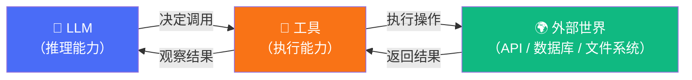
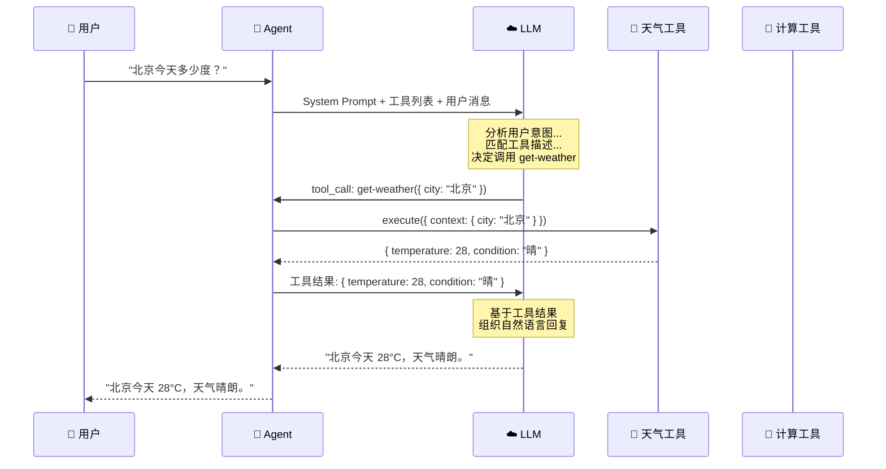

# 工具调用

## 为什么需要工具？

LLM 的知识有两个根本性限制：

1. **训练数据截止**：无法获取实时信息（今天的天气、最新的股价）
2. **纯文本推理**：无法执行真正的操作（发邮件、查数据库、调 API）

**工具**（Tool）就是解决这两个问题的桥梁——它们让 LLM 能够**与真实世界交互**。



## `createTool()` 详解

Mastra 使用 `createTool()` 函数定义工具。每个工具由四部分组成：

```typescript
import { createTool } from "@mastra/core/tools";
import { z } from "zod";

const weatherTool = createTool({
  id: "get-weather",                              // 唯一标识符
  description: "获取指定城市的当前天气信息",           // LLM 用此描述判断何时调用
  inputSchema: z.object({                          // 输入参数的 Zod schema
    city: z.string().describe("城市名称，如'北京'"),
    unit: z.enum(["celsius", "fahrenheit"])
           .default("celsius")
           .describe("温度单位"),
  }),
  outputSchema: z.object({                         // 输出结果的 Zod schema
    temperature: z.number().describe("当前温度"),
    condition: z.string().describe("天气状况"),
    humidity: z.number().describe("湿度百分比"),
  }),
  execute: async ({ context }) => {                // 实际执行逻辑
    const { city, unit } = context;
    // 这里调用真实的天气 API
    const data = await fetchWeatherAPI(city, unit);
    return {
      temperature: data.temp,
      condition: data.weather,
      humidity: data.humidity,
    };
  },
});
```

### 四要素详解

| 要素 | 作用 | 重要性 |
|------|------|--------|
| `id` | 工具的唯一标识符 | 用于日志、调试和引用 |
| `description` | 描述工具的功能 | **极其重要**：LLM 完全依赖此描述决定是否调用 |
| `inputSchema` | Zod schema 定义输入参数 | 自动验证 LLM 生成的参数 |
| `execute` | 工具的实际执行函数 | 包含业务逻辑 |

> [!WARNING]
> `description` 是工具定义中**最重要的字段**。LLM 不会阅读你的 `execute` 代码——它只看 `description` 和 `inputSchema` 来决定何时以及如何调用工具。描述不清晰 = LLM 不知道何时用 = 工具形同虚设。

## Zod Schema：类型安全的基石

Mastra 使用 [Zod](https://zod.dev) 来定义工具的输入输出 schema。Zod schema 会被自动转换为 JSON Schema，发送给 LLM。

### 为什么选择 Zod？

```typescript
// Zod schema 一次定义，三重用途
const inputSchema = z.object({
  query: z.string().min(1).describe("搜索关键词"),
  limit: z.number().int().min(1).max(100).default(10)
         .describe("返回结果数量"),
});

// 1️⃣ TypeScript 类型推断
type Input = z.infer<typeof inputSchema>;
// { query: string; limit: number }

// 2️⃣ 运行时参数验证
inputSchema.parse({ query: "mastra", limit: 5 }); // ✅
inputSchema.parse({ query: "", limit: 5 });        // ❌ 抛出 ZodError

// 3️⃣ 自动转换为 JSON Schema 发送给 LLM
// { type: "object", properties: { query: { type: "string", ... } } }
```

### `.describe()` 的魔力

Zod 的 `.describe()` 方法会作为 JSON Schema 的 `description` 字段传递给 LLM，帮助它理解每个参数的含义：

```typescript
const schema = z.object({
  // ❌ 没有描述 —— LLM 只知道这是个 string
  name: z.string(),

  // ✅ 有描述 —— LLM 知道应该填什么
  name: z.string().describe("用户的全名，格式为'姓 名'"),
});
```

## `execute` 函数

`execute` 是工具的核心执行逻辑。它接收三个参数：

```typescript
const myTool = createTool({
  id: "my-tool",
  description: "示例工具",
  inputSchema: z.object({ input: z.string() }),
  execute: async ({ context, runtimeContext, abortSignal }) => {
    // context: 经过 Zod 验证的输入参数
    const { input } = context;

    // runtimeContext: 运行时上下文，可传递额外信息
    const apiKey = runtimeContext.get("apiKey");

    // abortSignal: 用于取消长时间运行的操作
    const response = await fetch(url, { signal: abortSignal });

    return { result: "done" };
  },
});
```

| 参数 | 类型 | 用途 |
|------|------|------|
| `context` | `z.infer<typeof inputSchema>` | 经过验证的输入参数 |
| `runtimeContext` | `RuntimeContext` | 运行时传入的额外上下文 |
| `abortSignal` | `AbortSignal` | 取消信号，用于超时控制 |

## 工具选择控制

Mastra 允许你控制 LLM 如何选择工具：

```typescript
// auto（默认）：LLM 自主决定是否调用工具
const result1 = await agent.generate("今天北京天气怎么样？", {
  toolChoice: "auto",
});

// required：强制 LLM 必须调用至少一个工具
const result2 = await agent.generate("查一下天气", {
  toolChoice: "required",
});

// none：禁止 LLM 调用任何工具
const result3 = await agent.generate("你好", {
  toolChoice: "none",
});

// 指定工具：强制调用特定工具
const result4 = await agent.generate("查一下天气", {
  toolChoice: { type: "tool", toolName: "get-weather" },
});
```

| 选项 | 行为 | 适用场景 |
|------|------|---------|
| `auto` | LLM 自主决定 | 通用场景（默认） |
| `required` | 必须调用工具 | 确保执行操作 |
| `none` | 禁止调用工具 | 纯对话模式 |
| `{ type: "tool", toolName }` | 指定工具 | 测试 / 确定性场景 |

## LLM 如何决定调用哪个工具？

理解这个过程对于编写有效的工具至关重要：



LLM 的决策依据：

1. **用户消息的语义**：理解用户"想做什么"
2. **工具的 `description`**：匹配"哪个工具能做"
3. **工具的 `inputSchema`**：理解"需要传什么参数"
4. **上下文推断**：从对话中提取参数值（如"北京"）

## 多工具场景

一个 Agent 可以同时拥有多个工具，LLM 会根据需要选择合适的工具——甚至在一次对话中多次调用不同工具：

```typescript
import { Agent } from "@mastra/core/agent";
import { createTool } from "@mastra/core/tools";
import { z } from "zod";

// 工具 1：天气查询
const weatherTool = createTool({
  id: "get-weather",
  description: "获取指定城市的当前天气信息",
  inputSchema: z.object({
    city: z.string().describe("城市名称"),
  }),
  execute: async ({ context }) => {
    return { temperature: 28, condition: "晴", city: context.city };
  },
});

// 工具 2：数学计算
const calculatorTool = createTool({
  id: "calculator",
  description: "执行数学计算，支持基本的四则运算和常见数学函数",
  inputSchema: z.object({
    expression: z.string().describe("数学表达式，如 '2 + 3 * 4'"),
  }),
  execute: async ({ context }) => {
    const result = eval(context.expression); // 仅做示例，生产环境请勿使用 eval
    return { expression: context.expression, result };
  },
});

// 工具 3：翻译
const translateTool = createTool({
  id: "translate",
  description: "将文本从一种语言翻译成另一种语言",
  inputSchema: z.object({
    text: z.string().describe("要翻译的文本"),
    from: z.string().describe("源语言，如 'zh'"),
    to: z.string().describe("目标语言，如 'en'"),
  }),
  execute: async ({ context }) => {
    // 调用翻译 API
    return { original: context.text, translated: "translated text" };
  },
});

// 创建拥有多工具的 Agent
const agent = new Agent({
  name: "multi-tool-agent",
  instructions: "你是一个多功能助手，可以查天气、做计算和翻译。",
  model: openai("gpt-4o"),
  tools: {
    "get-weather": weatherTool,
    "calculator": calculatorTool,
    "translate": translateTool,
  },
});

// LLM 会自主选择合适的工具
await agent.generate("北京今天多少度？");      // → 调用 get-weather
await agent.generate("计算 15% 的小费：餐费 328 元"); // → 调用 calculator
await agent.generate("把'你好世界'翻译成英文");       // → 调用 translate
```

## 完整代码示例

以下是 Demo 02 的核心代码：

```typescript
// demos/02-tool-calling/index.ts
import { Agent } from "@mastra/core/agent";
import { createTool } from "@mastra/core/tools";
import { z } from "zod";
import { getModel } from "../../src/mock/mock-model";

// 定义天气查询工具
const weatherTool = createTool({
  id: "get-weather",
  description: "获取指定城市的当前天气信息，包括温度、天气状况和湿度",
  inputSchema: z.object({
    city: z.string().describe("城市名称，如'北京'、'上海'"),
    unit: z.enum(["celsius", "fahrenheit"])
           .default("celsius")
           .describe("温度单位，默认摄氏度"),
  }),
  outputSchema: z.object({
    temperature: z.number(),
    condition: z.string(),
    humidity: z.number(),
    city: z.string(),
  }),
  execute: async ({ context }) => {
    console.log(`  🔧 工具执行: get-weather(${JSON.stringify(context)})`);
    // 模拟天气数据
    const weatherData: Record<string, any> = {
      "北京": { temperature: 28, condition: "晴", humidity: 45 },
      "上海": { temperature: 31, condition: "多云", humidity: 72 },
      "深圳": { temperature: 33, condition: "雷阵雨", humidity: 85 },
    };
    const data = weatherData[context.city] || {
      temperature: 25, condition: "未知", humidity: 50,
    };
    return { ...data, city: context.city };
  },
});

async function main() {
  const agent = new Agent({
    name: "weather-assistant",
    instructions: `你是一个天气查询助手。
      当用户询问天气时，使用 get-weather 工具查询。
      回复时请包含温度、天气状况和穿衣建议。`,
    model: getModel(),
    tools: { "get-weather": weatherTool },
  });

  // 测试工具调用
  console.log("--- 测试: 工具调用 ---");
  const result = await agent.generate("北京今天天气怎么样？");
  console.log(`✅ 回复: ${result.text}`);
  console.log(`📊 工具调用: ${JSON.stringify(result.toolCalls)}`);
}

main().catch(console.error);
```

## 最佳实践

::: tip 工具定义的最佳实践

1. **描述要清晰具体**
   - ❌ `"获取数据"`
   - ✅ `"根据股票代码获取当前实时股价，返回价格和涨跌幅"`

2. **Schema 要精确**
   - 使用 `.min()` / `.max()` / `.regex()` 添加约束
   - 每个字段都加 `.describe()` 说明

3. **错误处理要完善**
   ```typescript
   execute: async ({ context }) => {
     try {
       const data = await fetchAPI(context.query);
       return { success: true, data };
     } catch (error) {
       return { success: false, error: String(error) };
     }
   }
   ```

4. **保持工具单一职责**
   - 一个工具做一件事
   - 拆分复杂操作为多个小工具

5. **`outputSchema` 可选但推荐**
   - 帮助 LLM 理解工具的返回格式
   - 提供额外的类型安全
:::

## 下一步

工具让 Agent 能**做事情**。但有时候我们需要 LLM 按照**特定格式**输出——比如返回一个 JSON 对象而不是自由文本。下一章我们来学习 [结构化输出](./structured-output.md)。
