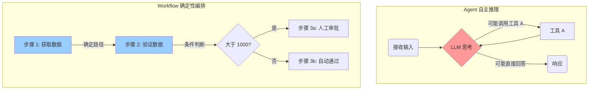
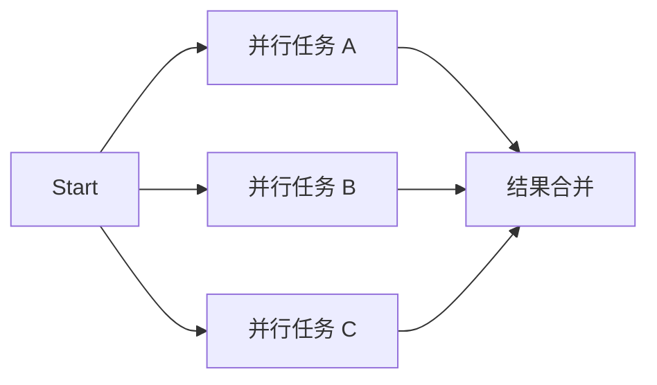
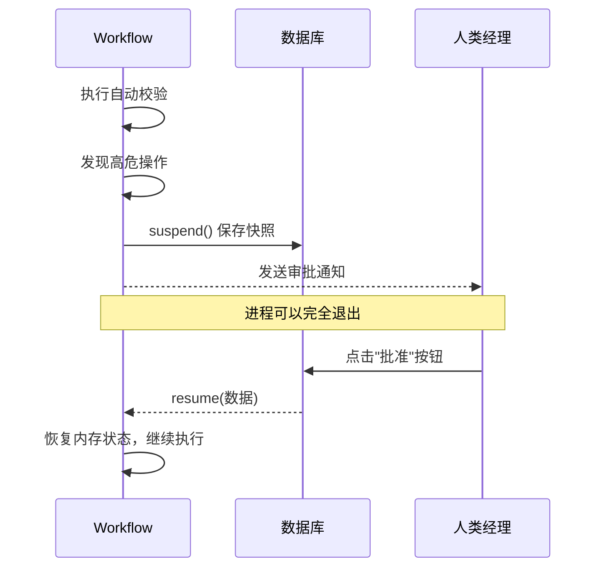

# 工作流引擎 — 确定性多步编排

在 AI 系统的开发中，我们经常面临一个权衡：**自主性** vs **确定性**。

## ⚖️ Agent vs Workflow



- **Agent 模式**：高度自主。LLM 自己决定是否调用工具、调用什么工具。灵活，但**不可预测**，可能偏离目标。
- **Workflow 模式**：图状态机（Graph State Machine）。开发者预先定义好执行路径。死板，但**极其稳定、可重复**。适合严谨的业务流程（如订单处理、内容发布）。

Mastra 提供了原生的 Workflow 引擎，让你可以在自主与确定之间找到平衡。

---

## 🧩 核心概念

工作流由两个核心原语组成：

1. **Step (步骤)**：工作流中的最小执行单元。包含 `id`、输入/输出的 Zod `schema`，以及执行逻辑 `execute`。
2. **Workflow (工作流)**：连接各个 Step 的图编排容器。

---

## 🔀 编排模式

Mastra Workflow 支持极其丰富的编排模式：

### 1. 顺序执行
最基础的模式，数据在一个接一个的步骤间传递。

```typescript
workflow
  .step(fetchData)
  .then(validateData)
  .then(saveData);
```

### 2. 并行执行 (Parallel)
当多个步骤没有依赖关系时，可以同时执行以大幅减少总耗时。



```typescript
workflow
  .step(start)
  .then(
    workflow.parallel([taskA, taskB, taskC])
  )
  .then(mergeResults);
```

### 3. 条件分支 (Branching)
根据上一步的结果，动态决定下一条执行路径。

```typescript
workflow
  .step(checkInventory)
  .then(
    workflow.branch([
      [{ inStock: true }, processOrder],
      [{ inStock: false }, notifyOutofStock]
    ])
  );
```

### 4. 循环 (Do While)
重复执行某一步骤，直到满足特定条件。例如：重试获取数据，直到数据验证通过。

---

## 🛑 人机协作 (Human In The Loop, HITL)

并非所有流程都能完全自动化。很多核心业务需要人工审批。Mastra 的工作流具备**状态持久化**和**挂起/恢复**能力。



在 Step 中，你可以调用 `suspend()` 暂停执行。随后通过传递保存的运行 ID 和人工输入的数据调用 `workflow.resume()` 来唤醒它。

---

## 💾 持久化与部署

Mastra 的工作流快照机制使其非常强健，能够跨越应用程序重启而恢复状态。

Mastra 支持多种部署后端：
1. **内置 Runner**：适合单机和中小型应用。
2. **Inngest**：无服务器友好的 Step 记忆化执行引擎。
3. **Temporal**：企业级的持久化执行引擎（Durable Execution），处理极大规模的并发工作流。

---
**下一步**：前往 `examples/demos/06-workflows.ts`，运行并在终端里直观感受多步、分支、并行的工作流是如何运行的！
