# 高级技能与自修复 (Self-Correction)

如果你只看简单的 Demo，你会觉得“工具调用 (Tool Calling)”太完美了：模型决定调天气 API -> 填入城市名字 -> 拿到结果。

但在真实的生产环境（即“深水区”）中，API 充满了不可预知性：
1. **模型幻觉**：大模型可能会捏造一个不存在的参数（比如填了个 `city: "不知道"`）。
2. **格式错误**：API 期望全小写拼音，模型给你传了中文。
3. **网络/服务端报错**：API 宕机，或者限流了。

## 初级 Agent vs 高阶 Agent

**初级 Agent 的处理方式**：
如果 `tool.execute()` 抛出 Error，框架直接把异常抛给最上层，导致整个进程崩溃，用户在界面上看到一行鲜红的 "Internal Server Error"。

**高阶 Agent (Mastra 推荐模式) 的处理方式**：
拦截工具错误，并利用大模型强大的**自省能力 (Reflection)** 进行自我修复。

## 自我修复 (Self-Correction) 流程图

```mermaid
sequenceDiagram
    participant LLM
    participant Agent Engine (Mastra)
    participant Weather Tool

    LLM->>Agent Engine: { tool: "getWeather", city: "北京" }
    Agent Engine->>Weather Tool: execute(city="北京")
    
    rect rgb(60, 20, 20)
    note right of Weather Tool: 触发严格校验
    Weather Tool-->>Agent Engine: ERROR: 必须使用全小写拼音 (e.g. 'beijing')
    end

    Agent Engine->>Agent Engine: 🚨 捕获错误，转换消息格式
    
    rect rgb(20, 60, 20)
    note right of Agent Engine: 触发自我修复循环
    Agent Engine->>LLM: Tool返回: { error: true, msg: "必须使用全小写拼音..." }
    LLM->>LLM: 思考: "啊，我参数填错了，我需要用拼音"
    LLM->>Agent Engine: { tool: "getWeather", city: "beijing" }
    end
    
    Agent Engine->>Weather Tool: execute(city="beijing")
    Weather Tool-->>Agent Engine: SUCCESS: "晴，25度"
    Agent Engine->>LLM: Tool返回: "晴，25度"
    LLM->>Agent Engine: "北京今天晴，25度"
```



## 实现自我修复的关键点

正如你在 Demo 11 中看到的，要实现这个闭环，有几个关键要求：
1. **Tool 必须抛出具有指导意义的 Error Message**：如果 Tool 只是单纯抛出一个 `Error: 500`，模型是不知道怎么修正的。必须把报错写成 Prompt 的口吻，例如 `"Invalid city format. Expected pinyin."`。
2. **Agent 引擎的 try-catch 拦截**：在调度 Tool 的外层包裹 try-catch。
3. **将 Error 转换为 Tool Message**：捕获到错误后，不能直接中断，而是要构造一个 `role: "tool"` 的上下文，将错误信息喂回去，并发起下一轮的大模型推理 (Next Loop)。
4. **设置最大重试次数 (MAX_RETRIES)**：防止大模型陷入无限试错的死循环。

## 运行 Demo

在 Demo 11 中，你可以看到整个错误拦截和自动恢复的模拟过程。

```bash
npm run demo:11
```
