# 记忆深度解构 (Memory Deep Dive)

初级的 AI 记忆仅仅是“历史记录的拼接”。随着对话越来越长，简单地将历史塞进 Prompt 会导致：
1. **Token 爆炸**：很快就会达到模型的输入上限。
2. **大海捞针 (Lost in the Middle)**：模型会对中间部分的信息失去注意力。
3. **状态冲突**：如果用户昨天说“我单身”，今天说“我恋爱了”，简单的拼接会让模型感到困惑。

Mastra 提供了四层记忆架构，而其中最核心且最具工程挑战的，是**观察者模式 (Observer/Reflector)** 和**工作记忆 (Working Memory)**。

## 什么是 Observer 模式？

大模型不仅可以用来生成对话回复，还可以用来作为“后台任务”进行数据压缩。

在真实的生产环境中，我们通常会配备一个完全独立的 **Observer Agent**。它的唯一工作就是在主线程与用户交互完之后，在**后台**默默地读取最新的对话记录，并将长篇的闲聊“提炼”为高度浓缩的 JSON 事实。

::: tip 异步执行
Observer 绝不应该阻塞主 Agent 对用户的响应。通常，当主 Agent 回复用户后，系统会将最近的几条历史扔进消息队列 (如 Redis Pub/Sub 或 Kafka)，由后台的 Worker 节点去执行 Observer 的推理。
:::

## 核心流程图

```mermaid
sequenceDiagram
    participant User as 用户
    participant Main as 主 Agent
    participant Memory as 工作记忆库 (DB)
    participant Observer as 观察者 Agent

    User->>Main: 我现在更喜欢香蕉了
    Main->>Memory: [预处理] 获取最新用户画像
    Memory-->>Main: "喜好: 苹果"
    Main->>Main: 将记忆与当前问题组装 Prompt
    Main-->>User: 好的，我记住了，你现在喜欢香蕉。
    
    rect rgb(30, 41, 59)
    note right of Observer: 异步/后台流程 (不阻塞响应)
    Main-xObserver: [触发] 发送最近的对话记录
    Observer->>Observer: LLM 推理: "提取到了喜好变更"
    Observer->>Observer: JSON: { factId: "favorite_fruit", value: "香蕉" }
    Observer->>Memory: 覆盖写入旧状态
    end
```



## 工作记忆的状态合并

在 Demo 09 中，我们展示了状态冲突是如何被解决的。
Observer 不仅负责提取，它还需要决定 `action: "update"` 并指定 `factId`。

当用户的情境发生变化时，更新后的 Working Memory 能够确保主 Agent 在下一次对话时拿到的是**最新鲜、且没有冲突的**唯一真理，而不是让主 Agent 自己去几百条历史中做矛盾推导。

## 运行 Demo

通过我们提供的深度解析脚本，你可以亲身体验这一过程。该脚本模拟了一个会自动将闲聊转换为背景知识库的双 Agent 协作系统。

```bash
npm run demo:09
```
