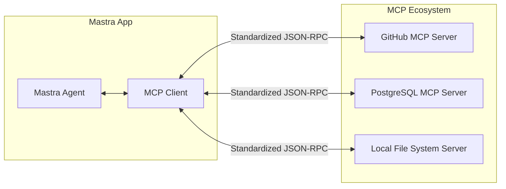

# Model Context Protocol (MCP)

In the past, if we wanted an AI Agent to read a GitHub repository, query Notion documents, or operate the local file system, we had to write custom integration code for every external service from scratch. This led to severe ecosystem fragmentation.

The **Model Context Protocol (MCP)**, proposed by Anthropic, aims to solve this problem. It can be understood as the "USB interface for AI Agents."

## What is MCP?

MCP adopts a Client-Server architecture:

- **MCP Server**: Wraps specific external resources (e.g., local files, GitHub, Notion) and exposes standardized tools, resources, and prompt templates.
- **MCP Client**: LLM applications (e.g., Mastra Agent, Cursor, Claude Desktop). Simply connect to a Server to automatically discover and invoke its capabilities.



With MCP, a Mastra Agent can seamlessly plug into the vast existing MCP open-source ecosystem, instantly gaining the ability to interact with hundreds of SaaS tools and local systems.

---

## MCP Client in Mastra

Mastra provides native first-class MCP client support. You can easily connect to any compatible MCP server.

```typescript
import { Agent } from '@mastra/core/agent';
import { McpClient } from '@mastra/mcp';

// 1. Create an MCP client and connect to an external server (e.g., a weather service)
const weatherClient = new McpClient({
  server: {
    command: 'npx',
    args: ['-y', '@weather-mcp/server'] // Command to run the external service
  }
});
await weatherClient.connect();

// 2. Mount the MCP client onto the Agent
const agent = new Agent({
  name: 'WeatherAgent',
  instructions: 'You can query the weather through MCP tools.',
  model: openai('gpt-4o'),
  // Core feature: automatically expose all tools from the server
  mcpClients: {
    weather: weatherClient 
  }
});
```

When the Agent starts, it automatically requests all available tools from the MCP Server and registers these tools' schemas with the LLM. This achieves exactly the same effect as manually writing `createTool` in Demo 02 — except it's all fully automatic!

---

## MCP Server in Mastra

Not only can Mastra act as a client, but it can also expose **your own Agents, Tools, and Workflows** as an MCP Server for other applications (e.g., Claude Desktop) to call.

```typescript
import { McpServer } from '@mastra/mcp';

const server = new McpServer();

// Expose your custom tools
server.registerTool(myCustomTool);
// Expose your Agent
server.registerAgent(myAgent);
// Expose your Workflow
server.registerWorkflow(myWorkflow);

// Start the server (using stdio or SSE transport)
server.start();
```

This way, you can develop complex business logic with Mastra and easily inject it into mainstream AI IDEs or chat clients.

---
**Next Step**: Go to `examples/demos/08-mcp.ts` to run the demo and experience this plug-and-play AI extensibility.
