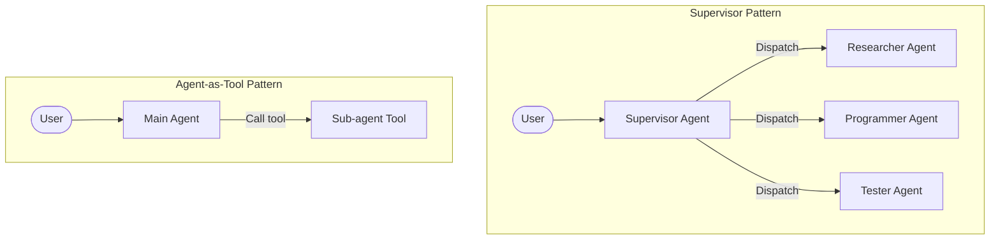

# Multi-Agent Collaboration

When task complexity exceeds the capacity of a single large model, splitting tasks among multiple **specialized Agents** focused on specific domains is the current best practice.

Mastra supports multiple forms of multi-agent network topologies.

## Common Collaboration Patterns



### 1. Supervisor Pattern
In this pattern, there is a centralized "Supervisor." It typically doesn't execute specific tasks itself; instead, it understands the user's overall goal, decomposes tasks, and distributes subtasks to subordinate specialized Agents. Finally, it aggregates all subordinates' reports and generates the final response.

### 2. Agent-as-Tool Pattern
In Mastra, any Agent can be wrapped as a Tool. This means one Agent can call another Agent just like calling a regular function (e.g., checking the weather).

### 3. Council Pattern
For complex decision-making problems, multiple Agents with different "perspectives" (Prompts) discuss the same problem, and a summary Agent makes the final call. This effectively reduces LLM hallucination and bias.

---

## Implementing Agent-as-Tool in Mastra

Turning one Agent into another Agent's tool is very simple in Mastra. This composability is infinite.

```typescript
import { Agent } from '@mastra/core/agent';
import { createTool } from '@mastra/core/tools';
import { z } from 'zod';

// 1. Define a specialized sub-agent
const researcherAgent = new Agent({
  name: 'Researcher',
  instructions: 'You are a deep researcher, skilled at summarizing key information from large texts.',
  model: openai('gpt-4o'),
});

// 2. Wrap the sub-agent as a Tool
const researchTool = createTool({
  id: 'deep-research',
  description: 'Call this tool when deep summarization of a complex topic is needed.',
  inputSchema: z.object({ topic: z.string() }),
  execute: async ({ context }) => {
    // Call another Agent inside the tool
    const result = await researcherAgent.generate(`Please research and summarize: ${context.topic}`);
    return result.text;
  }
});

// 3. Give the tool to the main Agent
const mainAgent = new Agent({
  name: 'Manager',
  instructions: 'You communicate with the user. If a topic requires deep research, call the research tool.',
  model: openai('gpt-4o'),
  tools: { researchTool }
});
```

---

## Why Not Put Everything in One Prompt?

You might ask: *Why not just write one super-long System Prompt telling a single model "you are both a researcher, a programmer, and a supervisor"?*

1. **Token limits and attention dilution (Lost in the Middle)**: The longer the prompt, the lower the model's adherence to instructions, and the easier it forgets earlier requirements.
2. **Tool conflicts**: If one Agent carries 50 tools, its probability of selecting the wrong tool increases significantly. Specialized sub-agents only need to mount the 3 tools they actually need.
3. **Context isolation**: A coding Agent doesn't need to see the tens of thousands of words in the researcher's intermediate literature search process — it only needs the final summary. This saves a massive amount of context space and API costs.

---
**Next Step**: Go to `examples/demos/07-multi-agent.ts` to run the demo and experience how multiple agents collaborate with clear division of labor!
