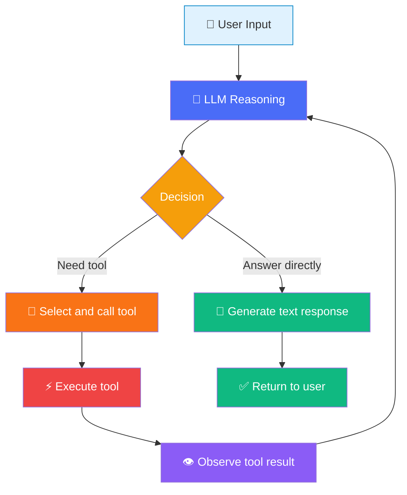

# Agent Basics

## What is an Agent?

In Mastra, an **Agent** is an LLM-driven autonomous entity. It can not only converse, but more importantly — it can **make autonomous decisions**.

> [!NOTE]
> Traditional LLM calls are "you ask once, it answers once." In Agent mode, the LLM can **decide on its own** whether to answer directly or first call a tool to gather information, then answer. This autonomous decision-making capability is the fundamental difference between an Agent and a simple LLM call.

## Agent Components

A Mastra Agent consists of three core components:

```typescript
import { Agent } from "@mastra/core/agent";
import { openai } from "@ai-sdk/openai";

const agent = new Agent({
  name: "research-assistant",        // Name: the Agent's identity
  instructions: `You are a research assistant.  // Instructions: the Agent's behavior guidelines (system prompt)
    You excel at retrieving and summarizing information.
    Cite sources in your answers.`,
  model: openai("gpt-4o"),           // Model: the Agent's "brain"
});
```

| Component | Purpose | Analogy |
|-----------|---------|---------|
| `name` | Unique identifier for logging and debugging | Employee ID |
| `instructions` | Defines the Agent's role, behavior, and constraints | Job description |
| `model` | Specifies which LLM to use for reasoning | Brain |

### The Importance of `instructions`

`instructions` is essentially the system prompt. It determines the Agent's "personality" and behavioral boundaries:

```typescript
// ❌ Vague instructions
const vagueAgent = new Agent({
  name: "vague",
  instructions: "Help the user.",
  model: openai("gpt-4o"),
});

// ✅ Precise instructions
const preciseAgent = new Agent({
  name: "code-reviewer",
  instructions: `You are a senior TypeScript code reviewer.
    Review rules:
    1. Check type safety
    2. Check if error handling is complete
    3. Check if SOLID principles are followed
    4. Provide improvement suggestions with code examples
    Output format: First summarize the number of issues, then analyze each one.`,
  model: openai("gpt-4o"),
});
```

## Agent Class Source Code Analysis

Mastra's `Agent` class comes from `@mastra/core/agent`. Let's look at its core structure:

```typescript
// Simplified Agent class core structure
class Agent {
  name: string;
  instructions: string | (() => string | Promise<string>);
  model: LanguageModel;
  tools?: Record<string, Tool>;
  memory?: Memory;

  async generate(
    messages: string | CoreMessage[],
    options?: AgentGenerateOptions
  ): Promise<AgentGenerateResult> {
    // 1. Assemble system prompt
    // 2. Format user messages
    // 3. Call LLM
    // 4. Handle tool calls (if any)
    // 5. Return result
  }

  async stream(
    messages: string | CoreMessage[],
    options?: AgentStreamOptions
  ): Promise<AgentStreamResult> {
    // Similar to generate, but returns streaming results
  }
}
```

> [!TIP]
> `instructions` can be not only a string but also a **function**. This means you can dynamically generate instructions — for example, adjusting the Agent's behavior based on current time, user identity, or context.

## `.generate()` Synchronous Call

`.generate()` is the most basic calling method — send a message and wait for the complete response:

```typescript
const agent = new Agent({
  name: "translator",
  instructions: "You are a Chinese-English translation assistant. When the user speaks Chinese, translate to English; when English, translate to Chinese.",
  model: openai("gpt-4o"),
});

// Simple string input
const result = await agent.generate("今天天气真不错");
console.log(result.text);
// Output: "The weather is really nice today"

// Structured message input
const result2 = await agent.generate([
  { role: "user", content: "Hello, how are you?" },
]);
console.log(result2.text);
// Output: "你好，你好吗？"
```

### Return Value Structure

```typescript
interface AgentGenerateResult {
  text: string;                // LLM-generated text
  toolCalls?: ToolCall[];      // Tool call records (if any)
  toolResults?: ToolResult[];  // Tool execution results (if any)
  usage: {
    promptTokens: number;      // Input token count
    completionTokens: number;  // Output token count
    totalTokens: number;       // Total token count
  };
}
```

## `.stream()` Streaming Call

When you need to display the LLM generation process in real time (e.g., chat UI), use `.stream()`:

```typescript
const agent = new Agent({
  name: "storyteller",
  instructions: "You are a storyteller, using vivid language to tell stories.",
  model: openai("gpt-4o"),
});

const stream = await agent.stream("Tell me a story about a brave knight");

// Read streaming output chunk by chunk
for await (const chunk of stream.textStream) {
  process.stdout.write(chunk); // Real-time output, no newline
}
console.log(); // Final newline
```

### `.generate()` vs `.stream()` Comparison

| Feature | `.generate()` | `.stream()` |
|---------|--------------|-------------|
| Return method | Wait for complete result | Chunk-by-chunk streaming |
| First-word latency | High (wait for full generation) | Low (return as generated) |
| Use case | Backend processing, batch tasks | Chat UI, real-time display |
| Memory usage | Load all at once | Streaming read, memory-friendly |

## Model Switching

Thanks to Vercel AI SDK's unified interface, switching LLM providers only requires changing one line of code:

::: code-group

```typescript [OpenAI]
import { openai } from "@ai-sdk/openai";

const agent = new Agent({
  name: "assistant",
  instructions: "You are a helpful assistant.",
  model: openai("gpt-4o"),
});
```

```typescript [Anthropic]
import { anthropic } from "@ai-sdk/anthropic";

const agent = new Agent({
  name: "assistant",
  instructions: "You are a helpful assistant.",
  model: anthropic("claude-sonnet-4-20250514"),
});
```

```typescript [Google Gemini]
import { google } from "@ai-sdk/google";

const agent = new Agent({
  name: "assistant",
  instructions: "You are a helpful assistant.",
  model: google("gemini-2.0-flash"),
});
```

:::

> [!WARNING]
> Different models have different capabilities. For example, tool calling performs best on GPT-4o and Claude Sonnet. After switching models, run Evals to assess performance differences.

## Agent Loop: The Intelligence Cycle

The Agent Loop is the **most critical concept** for understanding how Mastra Agents work. It explains how Agents cycle between "reasoning" and "acting":



### Loop Process Breakdown

1. **User input**: The user sends a message
2. **LLM reasoning**: The Agent sends instructions + conversation history + user message to the LLM
3. **Decision**: The LLM determines whether a tool is needed
   - If **no tool needed**: Generate text reply directly → return to user
   - If **tool needed**: Select tool and generate call parameters
4. **Execute tool**: Mastra executes the selected tool
5. **Observe result**: The tool's execution result is appended to conversation history
6. **Back to step 2**: The LLM continues reasoning based on the tool result

> [!IMPORTANT]
> Key insight: **It's the LLM that autonomously decides whether to use tools, not code logic.** The Agent merely provides an "environment" — a list of available tools and their descriptions. The LLM makes autonomous judgments based on the user's question and the tools' descriptions.

### Loop Count

By default, the Agent Loop has a maximum iteration limit (`maxSteps`) to prevent infinite loops:

```typescript
const result = await agent.generate("Check the weather for me", {
  maxSteps: 5, // Maximum 5 cycles (default is usually sufficient)
});
```

## Complete Code Example

Here's the complete Demo 01 code:

```typescript
// demos/01-agent-basics/index.ts
import { Agent } from "@mastra/core/agent";
import { getModel } from "../../src/mock/mock-model";

async function main() {
  // Create Agent
  const agent = new Agent({
    name: "my-assistant",
    instructions: `You are a helpful AI assistant.
      Your characteristics are concise, accurate, and well-organized answers.
      If unsure, honestly say "I'm not sure."`,
    model: getModel(), // Supports Mock mode
  });

  console.log(`🤖 Agent: ${agent.name}`);
  console.log(`📝 Instructions: ${agent.instructions}\n`);

  // Test 1: Basic conversation
  console.log('--- Test 1: Basic Conversation ---');
  const result1 = await agent.generate("Hello, please introduce yourself in one sentence.");
  console.log(`✅ Reply: ${result1.text}\n`);

  // Test 2: Streaming output
  console.log('--- Test 2: Streaming Output ---');
  const stream = await agent.stream("Please list three advantages of TypeScript.");
  process.stdout.write("✅ Reply: ");
  for await (const chunk of stream.textStream) {
    process.stdout.write(chunk);
  }
  console.log("\n");

  // Test 3: Multi-turn conversation
  console.log('--- Test 3: Multi-turn Conversation ---');
  const result3 = await agent.generate([
    { role: "user", content: "My name is Xiaoming" },
    { role: "assistant", content: "Hello Xiaoming! Nice to meet you." },
    { role: "user", content: "Do you still remember my name?" },
  ]);
  console.log(`✅ Reply: ${result3.text}\n`);

  console.log("--- Demo 01 Complete ---");
}

main().catch(console.error);
```

## Core Insight

::: info Agent is an Environment Provider
Mastra's Agent is essentially an **environment provider**, not a "command executor." The Agent provides:
- Identity (name + instructions)
- Capabilities (tools)
- Memory (memory)

And **all decisions are autonomously made by the LLM.** This is the fundamental difference between Agents and traditional programming paradigms — you're not writing if/else control logic, but building an environment for the LLM to make autonomous decisions.
:::

## Next Step

Now you understand Agent basics. But an Agent that can only "talk" is of limited use. In the next chapter we'll learn how to give Agents "hands and feet" — [Tool Calling](./tool-calling.md), letting them interact with the external world.
