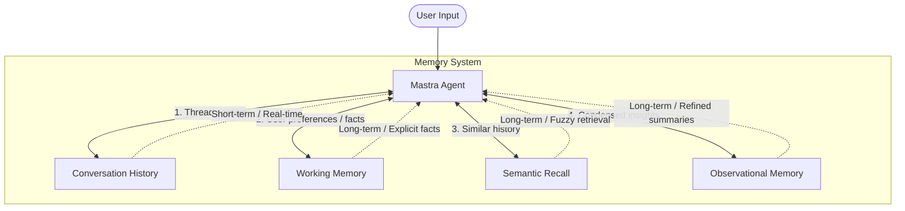

# Memory System — Giving Agents Memory

Agents are stateless by default, meaning they don't remember previous conversation content when processing each request. For complex tasks and long-term interaction, this is clearly insufficient.

Mastra provides a powerful **four-layer memory architecture**, allowing Agents to have memories with different lifecycles and purposes, just like humans.

## Four-Layer Memory Architecture

Mastra's memory system goes far beyond simple "history records." It divides memory into four dimensions:



### 1. Conversation History
- **Purpose**: Short-term memory, maintaining current conversation context.
- **Mechanism**: Stores the most recent N messages in the current Thread (e.g., `lastMessages: 20`).
- **Characteristics**: Sliding window — old messages are discarded to prevent exceeding token limits.

### 2. Working Memory
- **Purpose**: Long-term structured "sticky notes," storing explicit facts and preferences.
- **Mechanism**: Usually stored in Markdown or Zod Schema form.
- **Characteristics**: The Agent can explicitly read and update these facts (e.g., "the user likes Python," "the user's name is Zhang San").

### 3. Semantic Recall
- **Purpose**: Long-term fuzzy retrieval.
- **Mechanism**: Converts historical conversations into vector embeddings and stores them in a vector database.
- **Characteristics**: When the user mentions a topic, relevant historical fragments are retrieved through semantic similarity search and injected into the current context.

### 4. Observational Memory
- **Purpose**: Advanced context compression.
- **Mechanism**: A background **Observer Agent** condenses lengthy raw history into timestamped, prioritized "observations." A **Reflector Agent** periodically merges duplicates and discards low-priority details.
- **Characteristics**: Maintains an extremely stable context window during long-term conversations, preventing token explosion.

---

## Thread (Conversation Thread)

Memory is isolated by Thread. Each Thread represents an independent conversation (similar to a chat window in ChatGPT).

- **Creation**: When initializing a conversation, you can specify or generate a `threadId`.
- **Switching**: By passing different `threadId`s, the Agent can switch between different conversation contexts.

---

## Configuration Example

Configuring the memory system in Mastra is very intuitive:

```typescript
import { Agent } from '@mastra/core/agent';
import { Memory } from '@mastra/memory';
import { PgStorage } from '@mastra/pg-storage'; // Using PostgreSQL as example

// 1. Initialize storage backend
const storage = new PgStorage({ connectionString: process.env.DATABASE_URL });

// 2. Configure Memory instance
const memory = new Memory({
  storage,
  options: {
    lastMessages: 10, // Keep most recent 10 messages
    semanticRecall: {
      topK: 3, // Retrieve top 3 most relevant history entries
    },
    workingMemory: {
      enabled: true,
      // Can provide a Zod Schema to constrain working memory format
    }
  },
});

// 3. Attach Memory to Agent
const agent = new Agent({
  name: 'MemoryAgent',
  instructions: 'You are an assistant with memory.',
  model: openai('gpt-4o'),
  memory, 
});

// Usage: pass threadId
const response = await agent.generate('Hello, my name is Li Si', {
  threadId: 'thread-123' 
});
```

---

## Storage Backends

Mastra's memory system supports multiple storage backends, adapting to scenarios from local development to cloud production:
- **PostgreSQL** (`@mastra/pg-storage`)
- **LibSQL / Turso** (`@mastra/libsql-storage`)
- **Upstash / Redis** (`@mastra/upstash-storage`)
- **Local / In-memory** (for testing and demos)

---

## Best Practice: Which Memory Layer to Use When?

::: tip Memory Selection Guide
- **What was just said** → Rely on **Conversation History**.
- **User identity, explicit rules, long-term preferences** → Write to **Working Memory**.
- **Details of a bug discussed weeks ago** → Rely on **Semantic Memory** retrieval.
- **Open-ended chats lasting months** → Enable **Observational Memory** for intelligent compression.
:::

---
**Next Step**: Go to `examples/demos/04-memory.ts` to run the demo and experience firsthand how multi-layer memory is built from the ground up!
