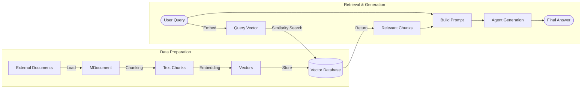

# RAG — Retrieval-Augmented Generation

LLMs have two natural limitations: **knowledge cutoff** (they don't know what happened after training data) and **hallucination** (they tend to make things up when they don't know the answer). For domain-specific enterprise data, LLMs are completely clueless.

**RAG (Retrieval-Augmented Generation)** was born to solve these problems. It allows Agents to dynamically search for information from external documents and feed that information into the LLM as context.

## RAG Full Pipeline

Mastra provides an end-to-end RAG pipeline, covering every step from document parsing to final generation.



---

## 1. Document Processing & Chunking

Long documents cannot be directly put into the LLM's context window and must be chunked. Mastra provides multiple chunking strategies:

| Strategy | Description | Use Case |
|----------|-------------|----------|
| `recursive` | Recursive splitting (paragraph → sentence → word) | Most commonly used, balances semantics and length |
| `sentence` | Split by sentence boundaries (。!?) | Suitable for short text fine-grained retrieval |
| `token` | Hard split by token count | Strictly controls context size |
| `markdown` / `html` | Recognize tag hierarchy for splitting | Structured documents |
| `semantic` | Merge sentences based on semantic similarity | Smartest, preserves semantic integrity |

**Chunking parameters:**
- `chunkSize`: Maximum length of each chunk.
- `chunkOverlap`: Overlap between chunks, preventing sentences from being harshly cut and losing context.

```typescript
import { MDocument } from '@mastra/rag';

const doc = new MDocument({ text: 'A very long piece of text...' });
const chunks = await doc.chunk({
  strategy: 'recursive',
  size: 512,
  overlap: 50,
});
```

---

## 2. Embedding Vector Generation

Embedding models map text to a point in high-dimensional vector space. Semantically similar text has closer vector distances.

Mastra standardizes the embedding API and supports multiple models:

```typescript
import { embed } from '@mastra/rag';
import { openai } from '@ai-sdk/openai';

const { embedding } = await embed({
  value: 'What is Mastra?',
  model: openai.embedding('text-embedding-3-small'),
});
```

---

## 3. Vector Database

Generated vectors need to be stored in specialized vector databases for fast retrieval. Mastra abstracts the storage layer, supporting smooth switching:

- **PgVector** (`@mastra/pg-storage`)
- **Pinecone** (`@mastra/pinecone-storage`)
- **Qdrant** (`@mastra/qdrant-storage`)

---

## 4. Retrieval & Context Injection

When the user asks a question, the RAG pipeline:
1. Converts the question into a vector.
2. Performs **similarity search** in the database (Cosine Similarity).
3. Mastra also supports **Hybrid Search**, combining vector semantic search with traditional full-text retrieval (BM25) for more precise results.

Retrieved text is provided to the Agent:

```typescript
// In Mastra, retrieval is usually wrapped as a Tool
const searchKnowledgeTool = createTool({
  id: 'search-docs',
  description: 'Query technical documentation about the Mastra framework',
  inputSchema: z.object({ query: z.string() }),
  execute: async ({ context }) => {
    // 1. Embed query
    const { embedding } = await embed({ value: context.query, model });
    // 2. Search database
    const results = await vectorStore.search(embedding, { topK: 3 });
    // 3. Return text
    return results.map(r => r.metadata.text).join('\n\n');
  }
});
```

---

::: warning Best Practice to Reduce Hallucinations
Simply providing retrieval results is not enough. You need to explicitly state in the Agent's `instructions`:
> "Answer based only on the provided reference materials. If you can't find the answer in the materials, honestly say 'I don't know' — **never** make up information."
:::

---
**Next Step**: Go to `examples/demos/05-rag.ts` to run the demo and see how the Agent searches for answers from an external document library!
