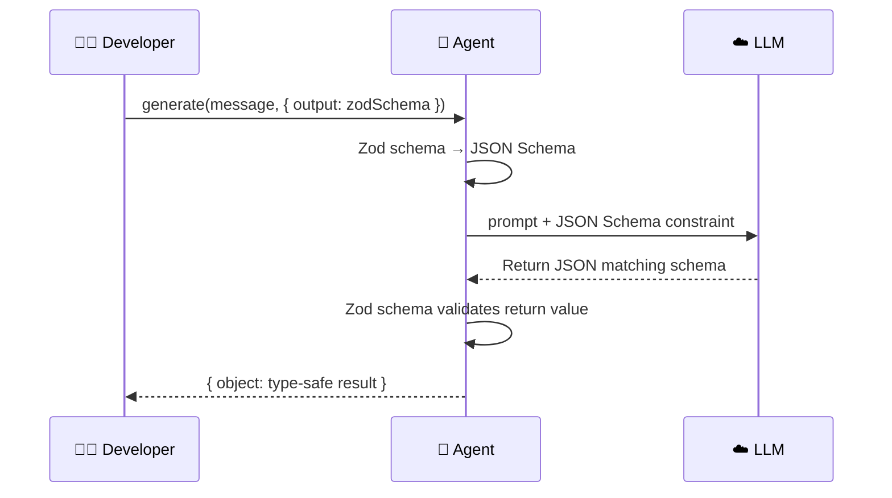

# Structured Output

## Why Do We Need Structured Output?

By default, LLMs return free-form text. But in practical applications, we often need **parseable, type-safe** results:

```typescript
// ❌ Free text — unreliable, hard to parse
"This movie scores 8.5, directed by Christopher Nolan, released in 2023..."

// ✅ Structured output — type-safe, ready to use
{
  title: "Oppenheimer",
  rating: 8.5,
  director: "Christopher Nolan",
  year: 2023,
  genres: ["Biography", "History", "Drama"]
}
```

> [!NOTE]
> Structured output and tool calling are two different concepts:
> - **Tool calling**: Expands the Agent's **capabilities** (lets it do new things)
> - **Structured output**: Constrains the Agent's **output format** (lets it return data in a required format)

## Zod Schema as Output Contract

In Mastra, use the `structuredOutput` option + Zod schema to constrain the LLM's output format:

```typescript
import { Agent } from "@mastra/core/agent";
import { openai } from "@ai-sdk/openai";
import { z } from "zod";

const agent = new Agent({
  name: "extractor",
  instructions: "You are an information extraction assistant. Extract structured information from user-provided text.",
  model: openai("gpt-4o"),
});

// Define output structure
const movieSchema = z.object({
  title: z.string().describe("Movie title"),
  rating: z.number().min(0).max(10).describe("Rating (0-10)"),
  director: z.string().describe("Director name"),
  year: z.number().describe("Release year"),
  genres: z.array(z.string()).describe("List of movie genres"),
});

const result = await agent.generate(
  "Oppenheimer is a 2023 biography history drama directed by Christopher Nolan, IMDb rating 8.5.",
  {
    output: movieSchema,
  }
);

// result.object is type-safe!
// TypeScript knows its type is { title: string; rating: number; ... }
console.log(result.object);
// {
//   title: "Oppenheimer",
//   rating: 8.5,
//   director: "Christopher Nolan",
//   year: 2023,
//   genres: ["Biography", "History", "Drama"]
// }
```

### Workflow



## Simple Schema vs. Complex Nested Schema

### Simple Schema

```typescript
// Sentiment analysis
const sentimentSchema = z.object({
  sentiment: z.enum(["positive", "negative", "neutral"])
              .describe("Sentiment orientation"),
  confidence: z.number().min(0).max(1)
              .describe("Confidence, 0 to 1"),
  keywords: z.array(z.string())
            .describe("Key sentiment words"),
});

const result = await agent.generate(
  "The food at this restaurant is very delicious, service is also very attentive, just slightly expensive.",
  { output: sentimentSchema }
);

console.log(result.object);
// {
//   sentiment: "positive",
//   confidence: 0.75,
//   keywords: ["delicious", "attentive", "expensive"]
// }
```

### Complex Nested Schema

```typescript
// Project plan generation
const projectPlanSchema = z.object({
  projectName: z.string().describe("Project name"),
  overview: z.string().describe("Project overview, 2-3 sentences"),
  phases: z.array(
    z.object({
      name: z.string().describe("Phase name"),
      duration: z.string().describe("Estimated duration, e.g. '2 weeks'"),
      tasks: z.array(
        z.object({
          title: z.string().describe("Task title"),
          priority: z.enum(["high", "medium", "low"])
                    .describe("Priority"),
          assignee: z.string().optional()
                    .describe("Assignee (optional)"),
        })
      ).describe("Task list for this phase"),
    })
  ).describe("List of project phases"),
  risks: z.array(
    z.object({
      description: z.string().describe("Risk description"),
      mitigation: z.string().describe("Mitigation measure"),
    })
  ).describe("List of project risks"),
  totalEstimate: z.string().describe("Total duration estimate"),
});

const result = await agent.generate(
  "Help me create a project plan for developing an AI chatbot",
  { output: projectPlanSchema }
);

// result.object contains a complete, nested, type-safe project plan
console.log(result.object.phases[0].tasks[0].title);
```

## Structured Output vs. Tool Calling

These two are often confused. Let's clearly distinguish them:

| Dimension | Structured Output | Tool Calling |
|-----------|------------------|--------------|
| Purpose | Constrain output **format** | Expand **capabilities** |
| Schema purpose | Define return value structure | Define input parameters |
| Execution logic | None (LLM directly generates JSON) | Yes (executes `execute` function) |
| Side effects | None | Possible (API calls, file writes, etc.) |
| Return location | `result.object` | `result.toolResults` |

```mermaid
graph TB
    subgraph StructuredOutput["Structured Output"]
        SO1["User Input"] --> SO2["LLM generates JSON"]
        SO2 --> SO3["Zod validation"]
        SO3 --> SO4["Return result.object"]
    end

    subgraph ToolCalling["Tool Calling"]
        TC1["User Input"] --> TC2["LLM generates tool call"]
        TC2 --> TC3["Execute execute function"]
        TC3 --> TC4["LLM replies based on result"]
        TC4 --> TC5["Return result.text"]
    end

    style StructuredOutput fill:#e0f2fe,stroke:#0284c7
    style ToolCalling fill:#fef3c7,stroke:#f59e0b
```



### When to Use Which?

| Scenario | Recommended Approach |
|----------|---------------------|
| Extract information from text | ✅ Structured output |
| Generate plans / solutions | ✅ Structured output |
| Query database | ✅ Tool calling |
| Send notifications / emails | ✅ Tool calling |
| Classification / tagging | ✅ Structured output |
| Get real-time data | ✅ Tool calling |

## Practical Cases

### Case 1: Entity Extraction

```typescript
const entitySchema = z.object({
  people: z.array(z.object({
    name: z.string(),
    role: z.string().optional(),
  })).describe("People mentioned"),
  organizations: z.array(z.string()).describe("Organizations mentioned"),
  locations: z.array(z.string()).describe("Locations mentioned"),
  dates: z.array(z.string()).describe("Dates or times mentioned"),
});

const result = await agent.generate(
  "On March 15, 2024, Apple CEO Tim Cook announced a new product at the Cupertino headquarters in California.",
  { output: entitySchema }
);
// {
//   people: [{ name: "Tim Cook", role: "CEO" }],
//   organizations: ["Apple"],
//   locations: ["California", "Cupertino"],
//   dates: ["March 15, 2024"]
// }
```

### Case 2: Data Transformation

```typescript
const convertSchema = z.object({
  rows: z.array(z.object({
    name: z.string(),
    email: z.string().email(),
    department: z.string(),
  })),
  totalCount: z.number(),
});

const result = await agent.generate(
  `Organize the following information into table data:
  Zhang San works in Tech, email zhang@example.com
  Li Si is in Marketing, email li@example.com
  Wang Wu is in HR, email is wang@example.com`,
  { output: convertSchema }
);
// {
//   rows: [
//     { name: "Zhang San", email: "zhang@example.com", department: "Tech" },
//     { name: "Li Si", email: "li@example.com", department: "Marketing" },
//     { name: "Wang Wu", email: "wang@example.com", department: "HR" }
//   ],
//   totalCount: 3
// }
```

### Case 3: Scoring & Labeling

```typescript
const reviewSchema = z.object({
  summary: z.string().describe("Review summary, one sentence"),
  scores: z.object({
    taste: z.number().min(1).max(5).describe("Taste score"),
    service: z.number().min(1).max(5).describe("Service score"),
    environment: z.number().min(1).max(5).describe("Environment score"),
    value: z.number().min(1).max(5).describe("Value score"),
  }),
  tags: z.array(z.string()).describe("Tags, e.g. 'good for dates', 'easy parking'"),
  overallRating: z.number().min(1).max(5).describe("Overall rating"),
});

const result = await agent.generate(
  "Went to that new Japanese restaurant in the west of the city yesterday. The sashimi was very fresh, " +
  "and the sushi chef's skills were good. The waiters were very friendly and served quickly. " +
  "The decor was a minimalist Japanese style, quite atmospheric. Around 200 per person, " +
  "which is pretty good at this price point. Parking is a bit inconvenient.",
  { output: reviewSchema }
);
```

## Complete Code Example

```typescript
// demos/03-structured-output/index.ts
import { Agent } from "@mastra/core/agent";
import { z } from "zod";
import { getModel } from "../../src/mock/mock-model";

async function main() {
  const agent = new Agent({
    name: "analyzer",
    instructions: `You are a text analysis assistant.
      Accurately extract information from text and return it in the required format.
      If information is incomplete, fill with reasonable defaults.`,
    model: getModel(),
  });

  // --- Test 1: Simple structured output ---
  console.log("--- Test 1: Sentiment Analysis ---");
  const sentimentSchema = z.object({
    sentiment: z.enum(["positive", "negative", "neutral"]),
    confidence: z.number(),
    summary: z.string(),
  });

  const r1 = await agent.generate(
    "This product is really amazing, completely exceeded my expectations!",
    { output: sentimentSchema }
  );
  console.log("Result:", JSON.stringify(r1.object, null, 2));

  // --- Test 2: Nested structured output ---
  console.log("\n--- Test 2: Project Analysis ---");
  const analysisSchema = z.object({
    techStack: z.array(z.string()).describe("Tech stack used"),
    complexity: z.enum(["low", "medium", "high"]).describe("Project complexity"),
    estimatedDays: z.number().describe("Estimated development days"),
    risks: z.array(z.object({
      risk: z.string(),
      severity: z.enum(["low", "medium", "high"]),
    })),
  });

  const r2 = await agent.generate(
    "Develop a real-time chat app based on React + Node.js, supporting message encryption and file transfer",
    { output: analysisSchema }
  );
  console.log("Result:", JSON.stringify(r2.object, null, 2));

  console.log("\n--- Demo 03 Complete ---");
}

main().catch(console.error);
```

## Tips & Notes

::: tip Schema Design Tips

1. **Keep schemas focused**
   - Extract one type of information at a time
   - Avoid "catch-all" schemas

2. **Make good use of `.describe()`**
   - Add descriptions to every field
   - Descriptions should be specific, with examples
   ```typescript
   // ✅ Good description
   z.string().describe("City name, e.g. 'Beijing', 'Shanghai'")

   // ❌ Poor description
   z.string().describe("City")
   ```

3. **Use `.optional()` for uncertain fields**
   ```typescript
   z.object({
     name: z.string(),            // Required
     nickname: z.string().optional(), // Optional
   })
   ```

4. **Use `z.enum()` to restrict value ranges**
   ```typescript
   z.enum(["low", "medium", "high"]) // More precise than z.string()
   ```

5. **Use `.default()` to provide defaults**
   ```typescript
   z.number().default(0).describe("Rating, default 0")
   ```
:::

> [!WARNING]
> Structured output reliability depends on the LLM's capability. GPT-4o and Claude Sonnet have the best JSON mode support. Weaker models may not strictly adhere to complex schema constraints.

## Next Step

By now you've mastered Mastra's three foundational capabilities: **Agent conversation**, **tool calling**, and **structured output**. Next we'll enter an entirely new domain — [Memory System](./memory.md), giving Agents the ability to "remember."
