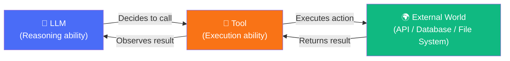
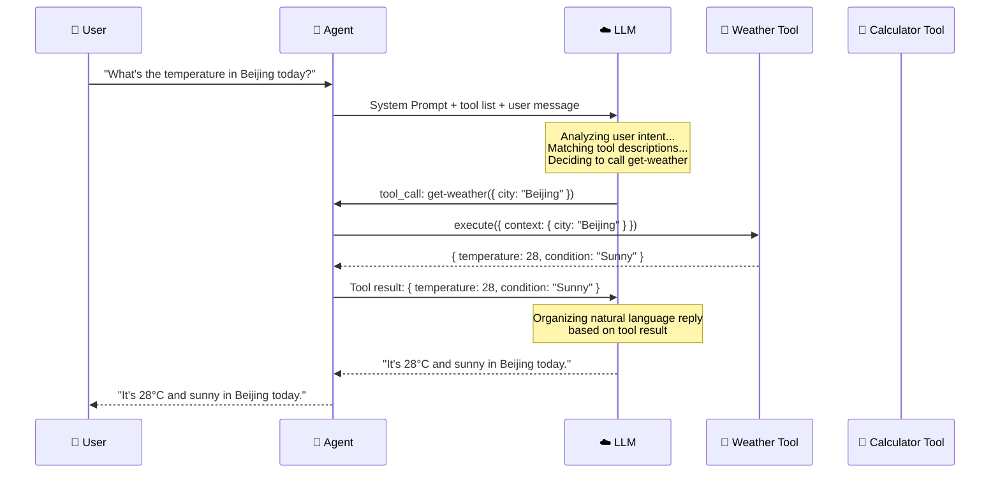

# Tool Calling

## Why Do We Need Tools?

LLM knowledge has two fundamental limitations:

1. **Training data cutoff**: Cannot access real-time information (today's weather, latest stock prices)
2. **Pure text reasoning**: Cannot perform real actions (send emails, query databases, call APIs)

**Tools** are the bridge that solves these two problems — they enable LLMs to **interact with the real world**.



## `createTool()` in Detail

Mastra uses the `createTool()` function to define tools. Each tool consists of four parts:

```typescript
import { createTool } from "@mastra/core/tools";
import { z } from "zod";

const weatherTool = createTool({
  id: "get-weather",                              // Unique identifier
  description: "Get current weather information for a specified city",           // LLM uses this description to decide when to call
  inputSchema: z.object({                          // Zod schema for input parameters
    city: z.string().describe("City name, e.g. 'Beijing'"),
    unit: z.enum(["celsius", "fahrenheit"])
           .default("celsius")
           .describe("Temperature unit"),
  }),
  outputSchema: z.object({                         // Zod schema for output results
    temperature: z.number().describe("Current temperature"),
    condition: z.string().describe("Weather condition"),
    humidity: z.number().describe("Humidity percentage"),
  }),
  execute: async ({ context }) => {                // Actual execution logic
    const { city, unit } = context;
    // Call real weather API here
    const data = await fetchWeatherAPI(city, unit);
    return {
      temperature: data.temp,
      condition: data.weather,
      humidity: data.humidity,
    };
  },
});
```

### Four Elements Explained

| Element | Purpose | Importance |
|---------|---------|------------|
| `id` | Tool's unique identifier | Used for logging, debugging, and referencing |
| `description` | Describes what the tool does | **Extremely important**: The LLM relies entirely on this description to decide whether to call |
| `inputSchema` | Zod schema defining input parameters | Automatically validates LLM-generated parameters |
| `execute` | Tool's actual execution function | Contains business logic |

> [!WARNING]
> `description` is the **most important field** in tool definition. The LLM won't read your `execute` code — it only looks at `description` and `inputSchema` to decide when and how to call the tool. Unclear description = LLM doesn't know when to use it = tool is useless.

## Zod Schema: The Cornerstone of Type Safety

Mastra uses [Zod](https://zod.dev) to define tool input/output schemas. Zod schemas are automatically converted to JSON Schema and sent to the LLM.

### Why Zod?

```typescript
// Zod schema: define once, use three ways
const inputSchema = z.object({
  query: z.string().min(1).describe("Search keyword"),
  limit: z.number().int().min(1).max(100).default(10)
         .describe("Number of results to return"),
});

// 1️⃣ TypeScript type inference
type Input = z.infer<typeof inputSchema>;
// { query: string; limit: number }

// 2️⃣ Runtime parameter validation
inputSchema.parse({ query: "mastra", limit: 5 }); // ✅
inputSchema.parse({ query: "", limit: 5 });        // ❌ Throws ZodError

// 3️⃣ Auto-convert to JSON Schema to send to LLM
// { type: "object", properties: { query: { type: "string", ... } } }
```

### The Magic of `.describe()`

Zod's `.describe()` method becomes the `description` field in JSON Schema, helping the LLM understand each parameter's meaning:

```typescript
const schema = z.object({
  // ❌ No description — LLM only knows it's a string
  name: z.string(),

  // ✅ With description — LLM knows what to fill in
  name: z.string().describe("User's full name, format 'First Last'"),
});
```

## `execute` Function

`execute` is the tool's core execution logic. It receives three parameters:

```typescript
const myTool = createTool({
  id: "my-tool",
  description: "Example tool",
  inputSchema: z.object({ input: z.string() }),
  execute: async ({ context, runtimeContext, abortSignal }) => {
    // context: Zod-validated input parameters
    const { input } = context;

    // runtimeContext: Runtime context for passing extra information
    const apiKey = runtimeContext.get("apiKey");

    // abortSignal: For canceling long-running operations
    const response = await fetch(url, { signal: abortSignal });

    return { result: "done" };
  },
});
```

| Parameter | Type | Purpose |
|-----------|------|---------|
| `context` | `z.infer<typeof inputSchema>` | Validated input parameters |
| `runtimeContext` | `RuntimeContext` | Extra context passed at runtime |
| `abortSignal` | `AbortSignal` | Cancel signal for timeout control |

## Tool Choice Control

Mastra allows you to control how the LLM selects tools:

```typescript
// auto (default): LLM autonomously decides whether to call tools
const result1 = await agent.generate("What's the weather in Beijing today?", {
  toolChoice: "auto",
});

// required: Force LLM to call at least one tool
const result2 = await agent.generate("Check the weather", {
  toolChoice: "required",
});

// none: Prohibit LLM from calling any tools
const result3 = await agent.generate("Hello", {
  toolChoice: "none",
});

// Specific tool: Force calling a specific tool
const result4 = await agent.generate("Check the weather", {
  toolChoice: { type: "tool", toolName: "get-weather" },
});
```

| Option | Behavior | Use Case |
|--------|----------|----------|
| `auto` | LLM decides autonomously | General scenarios (default) |
| `required` | Must call a tool | Ensure action execution |
| `none` | Prohibit tool calls | Pure conversation mode |
| `{ type: "tool", toolName }` | Specific tool | Testing / deterministic scenarios |

## How Does the LLM Decide Which Tool to Call?

Understanding this process is crucial for writing effective tools:



The LLM's decision criteria:

1. **Semantics of user message**: Understand what the user "wants to do"
2. **Tool's `description`**: Match "which tool can do it"
3. **Tool's `inputSchema`**: Understand "what parameters are needed"
4. **Context inference**: Extract parameter values from conversation (e.g., "Beijing")

## Multi-Tool Scenarios

An Agent can have multiple tools simultaneously, and the LLM will select the appropriate tool as needed — even calling different tools multiple times in one conversation:

```typescript
import { Agent } from "@mastra/core/agent";
import { createTool } from "@mastra/core/tools";
import { z } from "zod";

// Tool 1: Weather query
const weatherTool = createTool({
  id: "get-weather",
  description: "Get current weather information for a specified city",
  inputSchema: z.object({
    city: z.string().describe("City name"),
  }),
  execute: async ({ context }) => {
    return { temperature: 28, condition: "Sunny", city: context.city };
  },
});

// Tool 2: Math calculation
const calculatorTool = createTool({
  id: "calculator",
  description: "Perform mathematical calculations, supporting basic arithmetic and common math functions",
  inputSchema: z.object({
    expression: z.string().describe("Math expression, e.g. '2 + 3 * 4'"),
  }),
  execute: async ({ context }) => {
    const result = eval(context.expression); // Example only, don't use eval in production
    return { expression: context.expression, result };
  },
});

// Tool 3: Translation
const translateTool = createTool({
  id: "translate",
  description: "Translate text from one language to another",
  inputSchema: z.object({
    text: z.string().describe("Text to translate"),
    from: z.string().describe("Source language, e.g. 'zh'"),
    to: z.string().describe("Target language, e.g. 'en'"),
  }),
  execute: async ({ context }) => {
    // Call translation API
    return { original: context.text, translated: "translated text" };
  },
});

// Create Agent with multiple tools
const agent = new Agent({
  name: "multi-tool-agent",
  instructions: "You are a multi-functional assistant that can check weather, do calculations, and translate.",
  model: openai("gpt-4o"),
  tools: {
    "get-weather": weatherTool,
    "calculator": calculatorTool,
    "translate": translateTool,
  },
});

// LLM autonomously selects appropriate tools
await agent.generate("What's the temperature in Beijing today?");      // → calls get-weather
await agent.generate("Calculate 15% tip: meal cost 328 yuan"); // → calls calculator
await agent.generate("Translate 'Hello world' to English");       // → calls translate
```

## Complete Code Example

Here's the core code from Demo 02:

```typescript
// demos/02-tool-calling/index.ts
import { Agent } from "@mastra/core/agent";
import { createTool } from "@mastra/core/tools";
import { z } from "zod";
import { getModel } from "../../src/mock/mock-model";

// Define weather query tool
const weatherTool = createTool({
  id: "get-weather",
  description: "Get current weather information for a specified city, including temperature, weather condition, and humidity",
  inputSchema: z.object({
    city: z.string().describe("City name, e.g. 'Beijing', 'Shanghai'"),
    unit: z.enum(["celsius", "fahrenheit"])
           .default("celsius")
           .describe("Temperature unit, default is Celsius"),
  }),
  outputSchema: z.object({
    temperature: z.number(),
    condition: z.string(),
    humidity: z.number(),
    city: z.string(),
  }),
  execute: async ({ context }) => {
    console.log(`  🔧 Tool executing: get-weather(${JSON.stringify(context)})`);
    // Simulate weather data
    const weatherData: Record<string, any> = {
      "Beijing": { temperature: 28, condition: "Sunny", humidity: 45 },
      "Shanghai": { temperature: 31, condition: "Cloudy", humidity: 72 },
      "Shenzhen": { temperature: 33, condition: "Thunderstorm", humidity: 85 },
    };
    const data = weatherData[context.city] || {
      temperature: 25, condition: "Unknown", humidity: 50,
    };
    return { ...data, city: context.city };
  },
});

async function main() {
  const agent = new Agent({
    name: "weather-assistant",
    instructions: `You are a weather query assistant.
      When users ask about weather, use the get-weather tool to query.
      Include temperature, weather condition, and clothing advice in your reply.`,
    model: getModel(),
    tools: { "get-weather": weatherTool },
  });

  // Test tool calling
  console.log("--- Test: Tool Calling ---");
  const result = await agent.generate("How's the weather in Beijing today?");
  console.log(`✅ Reply: ${result.text}`);
  console.log(`📊 Tool calls: ${JSON.stringify(result.toolCalls)}`);
}

main().catch(console.error);
```

## Best Practices

::: tip Tool Definition Best Practices

1. **Descriptions should be clear and specific**
   - ❌ `"Get data"`
   - ✅ `"Get real-time stock price by ticker symbol, returning price and change percentage"`

2. **Schema should be precise**
   - Use `.min()` / `.max()` / `.regex()` to add constraints
   - Add `.describe()` to every field

3. **Error handling should be robust**
   ```typescript
   execute: async ({ context }) => {
     try {
       const data = await fetchAPI(context.query);
       return { success: true, data };
     } catch (error) {
       return { success: false, error: String(error) };
     }
   }
   ```

4. **Keep tools single-purpose**
   - One tool does one thing
   - Split complex operations into multiple small tools

5. **`outputSchema` is optional but recommended**
   - Helps the LLM understand the tool's return format
   - Provides additional type safety
:::

## Next Step

Tools let Agents **do things**. But sometimes we need the LLM to output in a **specific format** — like returning a JSON object instead of free text. In the next chapter we'll learn about [Structured Output](./structured-output.md).
