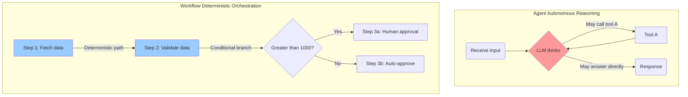
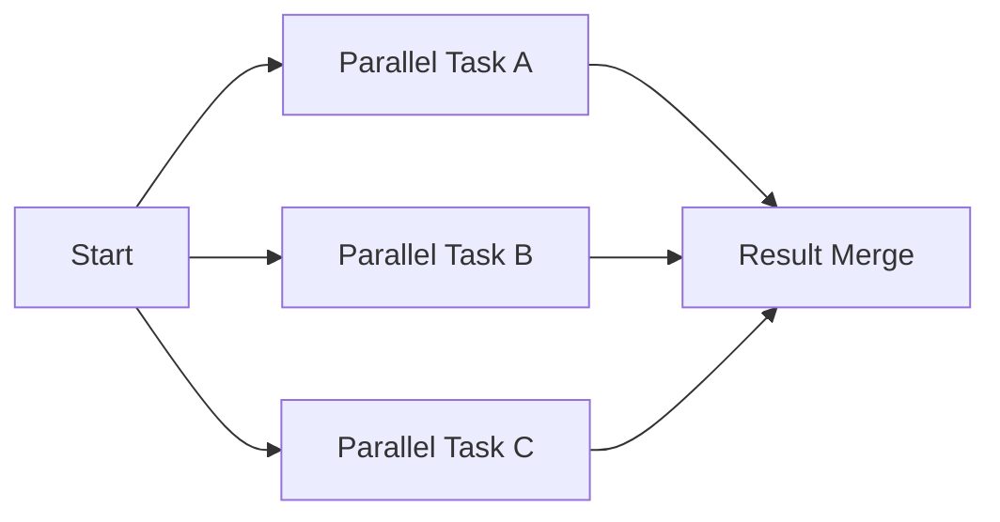
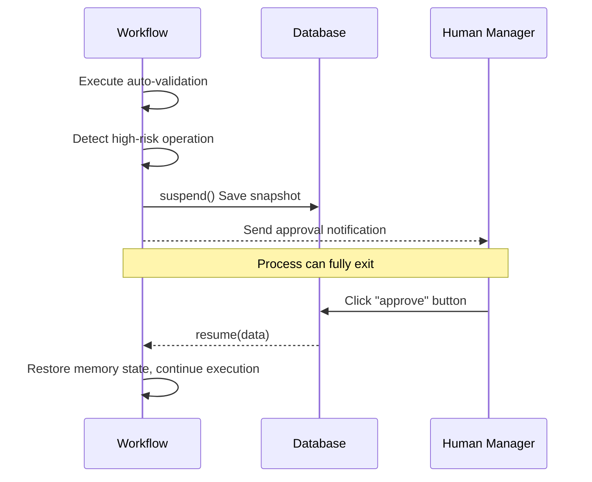

# Workflow Engine — Deterministic Multi-Step Orchestration

In AI system development, we often face a trade-off: **autonomy** vs. **determinism**.

## Agent vs. Workflow



- **Agent mode**: Highly autonomous. The LLM itself decides whether to call tools and which tools to call. Flexible, but **unpredictable** — may deviate from the goal.
- **Workflow mode**: Graph state machine. The developer pre-defines the execution path. Rigid, but **extremely stable and repeatable**. Suitable for rigorous business processes (e.g., order processing, content publishing).

Mastra provides a native Workflow engine, letting you find balance between autonomy and determinism.

---

## Core Concepts

A workflow consists of two core primitives:

1. **Step**: The smallest execution unit in a workflow. Contains an `id`, input/output Zod `schema`, and execution logic `execute`.
2. **Workflow**: A graph orchestration container that connects Steps.

---

## Orchestration Patterns

Mastra Workflow supports extremely rich orchestration patterns:

### 1. Sequential Execution
The most basic pattern — data passes from one step to the next.

```typescript
workflow
  .step(fetchData)
  .then(validateData)
  .then(saveData);
```

### 2. Parallel Execution
When multiple steps have no dependencies, they can execute simultaneously to greatly reduce total time.



```typescript
workflow
  .step(start)
  .then(
    workflow.parallel([taskA, taskB, taskC])
  )
  .then(mergeResults);
```

### 3. Conditional Branching
Dynamically decide the next execution path based on the previous step's result.

```typescript
workflow
  .step(checkInventory)
  .then(
    workflow.branch([
      [{ inStock: true }, processOrder],
      [{ inStock: false }, notifyOutofStock]
    ])
  );
```

### 4. Loop (Do While)
Repeatedly execute a step until a specific condition is met. For example: retry fetching data until validation passes.

---

## Human-in-the-Loop (HITL)

Not all processes can be fully automated. Many core business operations require human approval. Mastra's workflows have **state persistence** and **suspend/resume** capabilities.



In a Step, you can call `suspend()` to pause execution. Later, call `workflow.resume()` with the saved run ID and human-input data to wake it up.

---

## Persistence & Deployment

Mastra's workflow snapshot mechanism makes it very robust, able to resume state across application restarts.

Mastra supports multiple deployment backends:
1. **Built-in Runner**: Suitable for single-machine and small-to-medium applications.
2. **Inngest**: Serverless-friendly step memoization execution engine.
3. **Temporal**: Enterprise-grade durable execution engine, handling extremely large-scale concurrent workflows.

---
**Next Step**: Go to `examples/demos/06-workflows.ts`, run it and intuitively feel how multi-step, branching, and parallel workflows execute in the terminal!
