# Advanced Skills & Self-Correction

If you only look at simple demos, tool calling seems perfect: the model decides to call a weather API → fills in the city name → gets the result.

But in real production environments (the "deep water" zone), APIs are full of unpredictability:
1. **Model hallucination**: The LLM might fabricate a non-existent parameter (e.g., `city: "don't know"`).
2. **Format errors**: The API expects lowercase pinyin, but the model sends Chinese characters.
3. **Network / server errors**: The API is down or rate-limited.

## Junior Agent vs. Advanced Agent

**Junior Agent's approach**:
If `tool.execute()` throws an Error, the framework directly propagates the exception to the top level, crashing the entire process and leaving the user with a glaring "Internal Server Error."

**Advanced Agent (Mastra's recommended pattern)**:
Intercept tool errors and leverage the LLM's powerful **introspection (Reflection)** capability for self-repair.

## Self-Correction Flow Diagram

```mermaid
sequenceDiagram
    participant LLM
    participant Agent Engine (Mastra)
    participant Weather Tool

    LLM->>Agent Engine (Mastra): { tool: "getWeather", city: "Beijing" }
    Agent Engine (Mastra)->>Weather Tool: execute(city="Beijing")
    
    rect rgb(60, 20, 20)
    note right of Weather Tool: Trigger strict validation
    Weather Tool-->>Agent Engine (Mastra): ERROR: Must use lowercase pinyin (e.g. 'beijing')
    end

    Agent Engine (Mastra)->>Agent Engine (Mastra): 🚨 Catch error, convert message format
    
    rect rgb(20, 60, 20)
    note right of Agent Engine (Mastra): Trigger self-repair loop
    Agent Engine (Mastra)->>LLM: Tool returned: { error: true, msg: "Must use lowercase pinyin..." }
    LLM->>LLM: Thought: "Ah, my parameter was wrong, I need to use pinyin"
    LLM->>Agent Engine (Mastra): { tool: "getWeather", city: "beijing" }
    end
    
    Agent Engine (Mastra)->>Weather Tool: execute(city="beijing")
    Weather Tool-->>Agent Engine (Mastra): SUCCESS: "Sunny, 25°C"
    Agent Engine (Mastra)->>LLM: Tool returned: "Sunny, 25°C"
    LLM->>Agent Engine (Mastra): "It's sunny in Beijing today, 25°C"
```



## Key Implementation Points for Self-Correction

As you saw in Demo 11, to achieve this closed loop, there are several key requirements:
1. **Tools must throw instructive error messages**: If a tool just throws a generic `Error: 500`, the model won't know how to fix it. The error must be written in prompt-style language, e.g., `"Invalid city format. Expected pinyin."`
2. **Agent engine try-catch interception**: Wrap the tool dispatch in a try-catch.
3. **Convert error to tool message**: After catching the error, don't interrupt — construct a `role: "tool"` context, feed the error back, and initiate the next round of LLM reasoning (Next Loop).
4. **Set MAX_RETRIES**: Prevent the LLM from entering an infinite retry loop.

## Run the Demo

In Demo 11, you can see the entire error interception and auto-recovery simulation process.

```bash
npm run demo:11
```
