# Memory Deep Dive

Basic AI memory is nothing more than "concatenating historical records." As conversations grow longer, simply stuffing history into the prompt leads to:
1. **Token explosion**: You'll quickly hit the model's input limit.
2. **Lost in the Middle**: The model loses attention to information in the middle.
3. **State conflicts**: If the user said "I'm single" yesterday and "I'm in a relationship" today, simple concatenation confuses the model.

Mastra provides a four-layer memory architecture, and the most core and engineering-challenging aspect is the **Observer pattern** and **Working Memory**.

## What is the Observer Pattern?

Large models can not only generate conversation replies but also serve as "background tasks" for data compression.

In real production environments, we typically equip a completely independent **Observer Agent**. Its sole job is to read the latest conversation records in the **background** after the main thread interacts with the user, and distill lengthy chitchat into highly condensed JSON facts.

::: tip Async Execution
The Observer should never block the main Agent's response to the user. Typically, after the main Agent replies to the user, the system puts the most recent history into a message queue (like Redis Pub/Sub or Kafka), and background Worker nodes execute the Observer's reasoning.
:::

## Core Flow Diagram

```mermaid
sequenceDiagram
    participant User as User
    participant Main as Main Agent
    participant Memory as Working Memory DB
    participant Observer as Observer Agent

    User->>Main: I prefer bananas now
    Main->>Memory: [Pre-process] Get latest user profile
    Memory-->>Main: "Preference: apples"
    Main->>Main: Assemble prompt with memory + current question
    Main-->>User: Okay, I remember, you like bananas now.
    
    rect rgb(30, 41, 59)
    note right of Observer: Async / background process (non-blocking)
    Main-xObserver: [Trigger] Send recent conversation records
    Observer->>Observer: LLM reasoning: "Extracted preference change"
    Observer->>Observer: JSON: { factId: "favorite_fruit", value: "bananas" }
    Observer->>Memory: Overwrite old state
    end
```



## Working Memory State Merging

In Demo 09, we showed how state conflicts are resolved.
The Observer is not only responsible for extraction; it also needs to decide `action: "update"` and specify `factId`.

When the user's situation changes, the updated Working Memory ensures the main Agent gets the **freshest, conflict-free** single source of truth in the next conversation, rather than having the main Agent derive contradictions from hundreds of historical messages itself.

## Run the Demo

Through our deep-dive script, you can experience this process firsthand. The script simulates a dual-Agent collaboration system that automatically converts chitchat into a background knowledge base.

```bash
npm run demo:09
```
