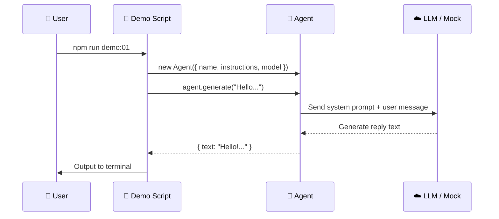

# Quick Start

## Prerequisites

Before starting, ensure your development environment meets the following requirements:

| Requirement | Minimum Version | Notes |
|-------------|----------------|-------|
| Node.js | 18+ | Recommended to use LTS version (20.x or 22.x) |
| npm / pnpm | Latest | Package manager |
| TypeScript | Basic knowledge | Understand types, interfaces, generics, etc. |
| LLM API Key | Optional | Mock mode supported, no real key needed |

> [!TIP]
> Not sure about your Node.js version? Run `node --version` to check. We recommend using [nvm](https://github.com/nvm-sh/nvm) to manage multiple Node.js versions.

## Clone & Install

### Get the Project Code

```bash
git clone https://github.com/your-repo/how-mastra-works.git
cd how-mastra-works
```

### Install Dependencies

::: code-group

```bash [npm]
npm install
```

```bash [pnpm]
pnpm install
```

:::

After installation, you should see the following core dependencies:

```json
{
  "dependencies": {
    "@mastra/core": "^0.10.x",
    "@ai-sdk/openai": "^1.x",
    "zod": "^3.x"
  },
  "devDependencies": {
    "typescript": "^5.x",
    "tsx": "^4.x"
  }
}
```

## Project Structure

```
how-mastra-works/
├── docs/                    # 📖 Documentation you're reading (VitePress)
│   ├── guide/               #    Guide chapters
│   ├── core/                #    Core concept chapters
│   └── advanced/            #    Advanced topic chapters
├── demos/                   # 🎯 Runnable example code
│   ├── 01-agent-basics/     #    Agent basics
│   ├── 02-tool-calling/     #    Tool calling
│   ├── 03-structured-output/#    Structured output
│   ├── 04-memory/           #    Memory system
│   ├── 05-rag/              #    RAG
│   ├── 06-workflows/        #    Workflows
│   ├── 07-multi-agent/      #    Multi-agent
│   ├── 08-mcp/              #    MCP protocol
│   └── 09-evals/            #    Evaluation
├── src/                     # 🧩 Shared utility code
│   ├── mock/                #    Mock mode implementation
│   └── utils/               #    General utility functions
├── .env.example             # 🔑 Environment variable template
├── package.json
└── tsconfig.json
```

Each `demos/` subdirectory is an independent, runnable example corresponding to a chapter in the documentation.

## Environment Variables

### Create `.env` File

```bash
cp .env.example .env
```

### Configuration Content

```bash
# ============================================
# LLM Provider API Key (configure at least one, or use Mock mode)
# ============================================

# OpenAI
OPENAI_API_KEY=sk-your-openai-key-here

# Anthropic (optional)
ANTHROPIC_API_KEY=sk-ant-your-key-here

# Google Gemini (optional)
GOOGLE_GENERATIVE_AI_API_KEY=your-key-here

# ============================================
# Mock mode (set to true to run without real API Key)
# ============================================
USE_MOCK=true
```

> [!IMPORTANT]
> For first-time learning, we strongly recommend setting `USE_MOCK=true`. This way all demos will use simulated LLM responses, letting you focus on understanding framework mechanisms.

## Run Your First Demo

### Launch Demo 01: Agent Basic Conversation

```bash
npm run demo:01
```

You should see output similar to this:

```
🤖 Agent: my-assistant
📝 Instructions: You are a helpful assistant...

--- Sending message: "Hello, please introduce yourself." ---

✅ Agent reply:
Hello! I'm an AI assistant, happy to serve you.
I can answer your questions, help you analyze information, provide suggestions, etc.
Is there anything I can help you with?

--- Demo 01 Complete ---
```

### What Happened?

Let's break down what happens behind the simplest demo:



1. **Create Agent**: Specify name, instructions, and model
2. **Call `.generate()`**: Send user message
3. **LLM processing**: Agent sends system prompt and user message to LLM
4. **Return result**: LLM generates text, Agent wraps and returns it

## Mock Mode Explained

Mock mode is a key design of this tutorial — it lets you run all demos without real API Keys.

### How It Works

```typescript
// src/mock/mock-model.ts
import { USE_MOCK } from "../utils/env";

export function getModel() {
  if (USE_MOCK) {
    // Return a mock model that returns preset responses based on input
    return createMockModel();
  }
  // Return real OpenAI model
  return openai("gpt-4o");
}
```

Mock model behavior:
- **Conversation**: Returns preset reasonable replies
- **Tool calling**: Simulates LLM selecting tools and passing parameters
- **Structured output**: Returns simulated data conforming to Zod schema
- **Streaming output**: Simulates streaming character by character

> [!NOTE]
> Mock mode responses are **deterministic** — the same input always produces the same output. This is very useful for learning and debugging, but should not be used in production.

### Switch to Real Model

When you're ready to use a real LLM:

1. Set `USE_MOCK=false` in `.env`
2. Fill in your API Key
3. Re-run the demo

```bash
# .env
USE_MOCK=false
OPENAI_API_KEY=sk-your-real-key
```

```bash
npm run demo:01
```

Now the Agent will call the real OpenAI API, and you'll see more natural and varied responses.

## FAQ

### Dependency installation failed?

```bash
# Clear cache and retry
rm -rf node_modules package-lock.json
npm install
```

### TypeScript compilation errors?

Ensure `tsconfig.json` is correctly configured:

```json
{
  "compilerOptions": {
    "target": "ES2022",
    "module": "ESNext",
    "moduleResolution": "bundler",
    "strict": true,
    "esModuleInterop": true,
    "skipLibCheck": true
  }
}
```

### Demo has no output or errors?

1. Check Node.js version: `node --version` (needs ≥ 18)
2. Check if `.env` file exists
3. Confirm `USE_MOCK=true` (first-time use)

## Next Step

Environment is ready! Now let's dive into the first core concept — [Agent Basics](../core/agent-basics.md), to understand the internal workings of Mastra Agents.
