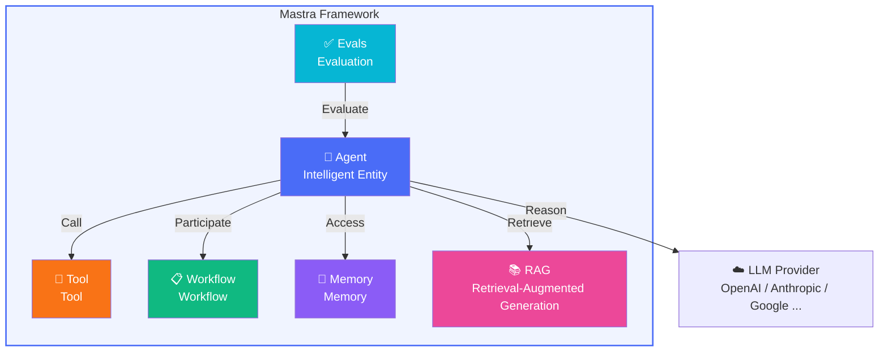

# Framework Introduction

## What is Mastra?

**Mastra** is a TypeScript-native AI Agent framework built by the Vercel AI SDK team. It provides developers with a complete set of primitives for rapidly building AI agent applications with reasoning, tool usage, memory, and collaboration capabilities.

> [!TIP]
> You can think of Mastra as the "Next.js" of the AI Agent world: it doesn't reinvent the wheel, but provides higher-level abstractions and developer experience on top of the mature Vercel AI SDK.

```typescript
import { Agent } from "@mastra/core/agent";
import { openai } from "@ai-sdk/openai";

const agent = new Agent({
  name: "my-assistant",
  instructions: "You are a helpful assistant.",
  model: openai("gpt-4o"),
});

const response = await agent.generate("Hello, please introduce yourself.");
console.log(response.text);
```

Just a few lines of code, and you have a conversational AI Agent. But Mastra is far more than this.

## What Problem Does It Solve?

In AI application development, developers face severe **fragmentation problems**:

| Challenge | Traditional Approach | Mastra Solution |
|-----------|-------------------|-----------------|
| LLM provider lock-in | Different APIs for each SDK | Unified access to 90+ providers via Vercel AI SDK |
| Tool calling | Manually assembling JSON Schema | `createTool()` + Zod auto-generation |
| Memory management | Self-built storage and retrieval logic | 4-layer memory system out of the box |
| Workflow orchestration | If/else spaghetti code | Graph state machine (Graph-based workflows) |
| RAG pipeline | Piecing together multiple libraries | Built-in chunk → embed → store → retrieve full pipeline |
| Evaluation testing | Lacking standardized solutions | Built-in Evals/Scorers system |

## Core Primitives Overview

Mastra's design philosophy is built around **6 core primitives**:



### Agent (Intelligent Entity)

Agent is the core of Mastra. It encapsulates an LLM, giving it a name, instructions (system prompt), and a set of tools. The Agent can autonomously decide when to use tools and when to reply directly.

### Tool (Tool)

Tools are the bridge between Agents and the external world. Defined via `createTool()`, each tool has a Zod schema for type validation, ensuring LLM-passed parameters are always valid.

### Workflow (Workflow)

Workflow is Mastra's process orchestration engine. Based on a directed graph state machine model, it supports conditional branching, parallel execution, human-in-the-loop, and other complex scenarios.

### Memory (Memory)

Mastra's memory system has 4 layers:
- **Conversation History**: Message-level short-term memory
- **Working Memory**: Cross-session user preferences / context
- **Semantic Recall**: Vector search-based relevant memory retrieval
- **Observational Memory**: Knowledge extracted and stored by the Agent from conversations

### RAG (Retrieval-Augmented Generation)

Complete RAG pipeline: Document chunking → Vectorization → Storage → Retrieval → Augmented generation. Supports multiple vector databases and embedding models.

### Evals (Evaluation)

Built-in evaluation framework providing multiple Scorers for quantifying Agent output quality — from factual accuracy to semantic relevance.

## Comparison with Other Frameworks

| Feature | Mastra | LangChain | CrewAI |
|---------|--------|-----------|--------|
| Language | TypeScript native | Python-first | Python |
| Type safety | ✅ Zod + TypeScript | ❌ Runtime validation | ❌ |
| LLM support | 90+ providers (Vercel AI SDK) | Multi-provider | Limited |
| Workflow | Graph state machine | Chain/LCEL | Sequential flow |
| Memory system | 4-layer architecture | Basic | Basic |
| MCP support | ✅ Client + Server | Community plugins | ❌ |
| Learning curve | Medium | Steep | Low |

> [!NOTE]
> Every framework has its applicable scenarios. Mastra is particularly suitable for TypeScript/JavaScript ecosystem developers, and projects requiring production-grade type safety and flexible orchestration capabilities.

## Built on Vercel AI SDK

Mastra is not built from scratch. It stands on the shoulders of the **Vercel AI SDK**, which means:

- **Unified model interface**: Use the same API to call OpenAI, Anthropic, Google Gemini, Mistral, and 90+ other LLM providers
- **Streaming native**: `.stream()` method works out of the box, supporting SSE and Web Streams
- **Standardized tool calling**: Automatically handles tool calling protocol differences across providers
- **Structured output**: Constrain LLM output format via Zod schema

```typescript
// Switching models only requires changing one line
import { openai } from "@ai-sdk/openai";
import { anthropic } from "@ai-sdk/anthropic";
import { google } from "@ai-sdk/google";

// Same Agent, different model
const agent = new Agent({
  name: "flexible-agent",
  instructions: "You are a flexible assistant.",
  model: anthropic("claude-sonnet-4-20250514"), // One-line switch
});
```

## Learning Path

This tutorial adopts a **progressive** approach, with each chapter building on the previous one:


Each chapter contains:
- **Concept explanation**: Explain core concepts in accessible language
- **Architecture diagrams**: Show internal workings with Mermaid diagrams
- **Code examples**: Runnable demos
- **Source code analysis**: Deep dive into Mastra source code to understand design decisions

> [!IMPORTANT]
> All demos support **Mock mode** — run without an LLM API Key. This lets you focus on understanding the framework mechanisms without worrying about API costs.

Ready? Let's start with [Quick Start](./getting-started.md)!
