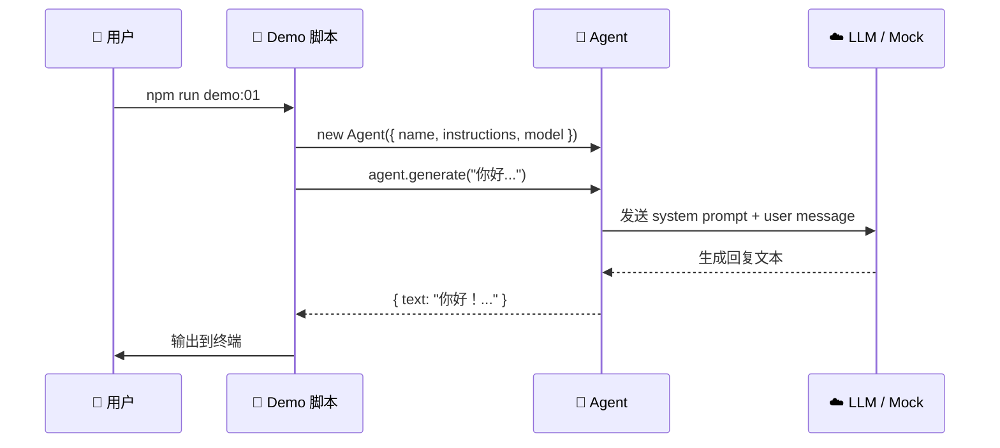

# 快速开始

## 前置条件

在开始之前，请确保你的开发环境满足以下要求：

| 要求 | 最低版本 | 说明 |
|------|---------|------|
| Node.js | 18+ | 推荐使用 LTS 版本（20.x 或 22.x） |
| npm / pnpm | 最新版 | 包管理器 |
| TypeScript | 基础知识 | 理解类型、接口、泛型等概念 |
| LLM API Key | 可选 | 支持 Mock 模式，无需真实 Key |

> [!TIP]
> 不确定 Node.js 版本？运行 `node --version` 检查。推荐使用 [nvm](https://github.com/nvm-sh/nvm) 管理多版本 Node.js。

## 克隆与安装

### 获取项目代码

```bash
git clone https://github.com/your-repo/how-mastra-works.git
cd how-mastra-works
```

### 安装依赖

::: code-group

```bash [npm]
npm install
```

```bash [pnpm]
pnpm install
```

:::

安装完成后，你应该能看到以下核心依赖：

```json
{
  "dependencies": {
    "@mastra/core": "^0.10.x",
    "@ai-sdk/openai": "^1.x",
    "zod": "^3.x"
  },
  "devDependencies": {
    "typescript": "^5.x",
    "tsx": "^4.x"
  }
}
```

## 项目结构

```
how-mastra-works/
├── docs/                    # 📖 你正在阅读的文档（VitePress）
│   ├── guide/               #    指南章节
│   ├── core/                #    核心概念章节
│   └── advanced/            #    进阶主题章节
├── demos/                   # 🎯 可运行的示例代码
│   ├── 01-agent-basics/     #    Agent 基础
│   ├── 02-tool-calling/     #    工具调用
│   ├── 03-structured-output/#    结构化输出
│   ├── 04-memory/           #    记忆系统
│   ├── 05-rag/              #    RAG
│   ├── 06-workflows/        #    工作流
│   ├── 07-multi-agent/      #    多智能体
│   ├── 08-mcp/              #    MCP 协议
│   └── 09-evals/            #    评估
├── src/                     # 🧩 共享工具代码
│   ├── mock/                #    Mock 模式实现
│   └── utils/               #    通用工具函数
├── .env.example             # 🔑 环境变量模板
├── package.json
└── tsconfig.json
```

每个 `demos/` 子目录都是一个独立的、可运行的示例，对应文档中的一章。

## 环境变量配置

### 创建 `.env` 文件

```bash
cp .env.example .env
```

### 配置内容

```bash
# ============================================
# LLM 提供商 API Key（至少配置一个，或使用 Mock 模式）
# ============================================

# OpenAI
OPENAI_API_KEY=sk-your-openai-key-here

# Anthropic（可选）
ANTHROPIC_API_KEY=sk-ant-your-key-here

# Google Gemini（可选）
GOOGLE_GENERATIVE_AI_API_KEY=your-key-here

# ============================================
# Mock 模式（设为 true 则无需真实 API Key）
# ============================================
USE_MOCK=true
```

> [!IMPORTANT]
> 首次学习时，强烈建议将 `USE_MOCK=true`。这样所有 Demo 都会使用模拟的 LLM 响应，你可以专注于理解框架机制。

## 运行第一个 Demo

### 启动 Demo 01：Agent 基础对话

```bash
npm run demo:01
```

你应该会看到类似如下的输出：

```
🤖 Agent: my-assistant
📝 Instructions: 你是一个有帮助的助手...

--- 发送消息: "你好，请介绍一下你自己。" ---

✅ Agent 回复:
你好！我是一个 AI 助手，很高兴为你服务。
我可以回答你的问题、帮你分析信息、提供建议等。
有什么我可以帮你的吗？

--- Demo 01 完成 ---
```

### 发生了什么？

让我们拆解这个最简单的 Demo 背后发生的事情：



1. **创建 Agent**：指定名称、指令和模型
2. **调用 `.generate()`**：发送用户消息
3. **LLM 处理**：Agent 将 system prompt 和用户消息发送给 LLM
4. **返回结果**：LLM 生成文本，Agent 封装后返回

## Mock 模式解析

Mock 模式是本教程的一个关键设计——它让你无需真实 API Key 也能运行所有 Demo。

### 工作原理

```typescript
// src/mock/mock-model.ts
import { USE_MOCK } from "../utils/env";

export function getModel() {
  if (USE_MOCK) {
    // 返回一个模拟模型，根据输入返回预设响应
    return createMockModel();
  }
  // 返回真实的 OpenAI 模型
  return openai("gpt-4o");
}
```

Mock 模型的行为：
- **对话**：返回预设的合理回复
- **工具调用**：模拟 LLM 选择工具并传入参数
- **结构化输出**：返回符合 Zod schema 的模拟数据
- **流式输出**：逐字模拟流式返回

> [!NOTE]
> Mock 模式下的响应是**确定性的**——同样的输入总是产生同样的输出。这对学习和调试非常有用，但生产环境中不应使用。

### 切换到真实模型

当你准备好使用真实 LLM 时：

1. 在 `.env` 中设置 `USE_MOCK=false`
2. 填入你的 API Key
3. 重新运行 Demo

```bash
# .env
USE_MOCK=false
OPENAI_API_KEY=sk-your-real-key
```

```bash
npm run demo:01
```

此时 Agent 会调用真实的 OpenAI API，你会看到更加自然和多样的回复。

## 常见问题

### 安装依赖失败？

```bash
# 清除缓存后重试
rm -rf node_modules package-lock.json
npm install
```

### TypeScript 编译错误？

确保 `tsconfig.json` 配置正确：

```json
{
  "compilerOptions": {
    "target": "ES2022",
    "module": "ESNext",
    "moduleResolution": "bundler",
    "strict": true,
    "esModuleInterop": true,
    "skipLibCheck": true
  }
}
```

### Demo 无输出或报错？

1. 检查 Node.js 版本：`node --version`（需 ≥ 18）
2. 检查 `.env` 文件是否存在
3. 确认 `USE_MOCK=true`（首次使用）

## 下一步

环境准备就绪！现在让我们深入第一个核心概念——[Agent 基础](../core/agent-basics.md)，理解 Mastra Agent 的内部工作原理。
