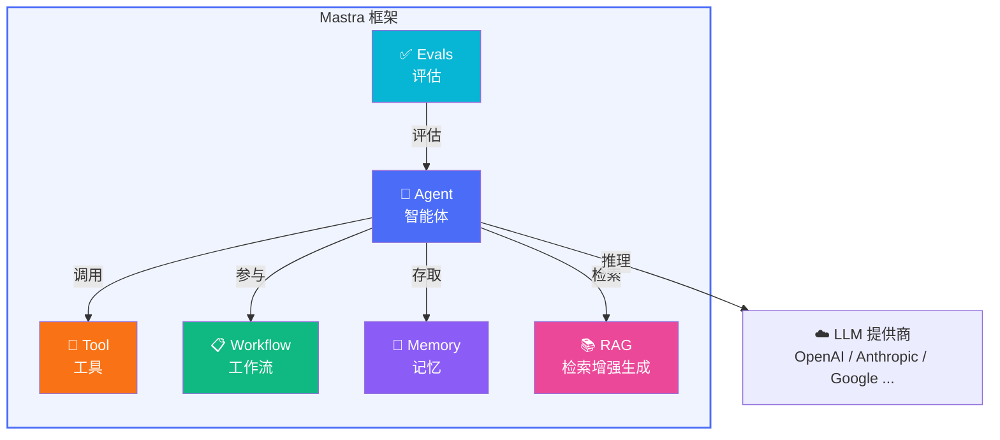

# 框架简介

## Mastra 是什么？

**Mastra** 是一个 TypeScript 原生的 AI Agent 框架，由 Vercel AI SDK 团队构建。它为开发者提供了一套完整的原语（primitives），用于快速构建具备推理、工具使用、记忆和协作能力的 AI 智能体应用。

> [!TIP]
> 你可以把 Mastra 理解为 AI Agent 世界的 "Next.js"：它不重新发明轮子，而是在成熟的 Vercel AI SDK 基础上，提供更高层次的抽象和开发体验。

```typescript
import { Agent } from "@mastra/core/agent";
import { openai } from "@ai-sdk/openai";

const agent = new Agent({
  name: "my-assistant",
  instructions: "你是一个有帮助的助手。",
  model: openai("gpt-4o"),
});

const response = await agent.generate("你好，请介绍一下你自己。");
console.log(response.text);
```

仅仅几行代码，你就拥有了一个能够对话的 AI Agent。但 Mastra 远不止于此。

## 它解决了什么问题？

在 AI 应用开发领域，开发者面临严重的**碎片化问题**：

| 挑战 | 传统做法 | Mastra 方案 |
|------|---------|------------|
| LLM 提供商锁定 | 每个 SDK 不同的 API | 通过 Vercel AI SDK 统一访问 90+ 提供商 |
| 工具调用 | 手动拼装 JSON Schema | `createTool()` + Zod 自动生成 |
| 记忆管理 | 自建存储和检索逻辑 | 4 层记忆系统开箱即用 |
| 工作流编排 | if/else 面条代码 | 图状态机（Graph-based workflows） |
| RAG 管道 | 拼凑多个库 | 内置 chunk → embed → store → retrieve 全链路 |
| 评估测试 | 缺少标准化方案 | 内置 Evals/Scorers 体系 |

## 核心原语一览

Mastra 的设计哲学是围绕 **6 个核心原语** 构建一切：



### Agent（智能体）

Agent 是 Mastra 的核心。它封装了一个 LLM，赋予它名称、指令（system prompt）和一组工具。Agent 能够自主决定何时使用工具、何时直接回复。

### Tool（工具）

工具是 Agent 与外部世界交互的桥梁。通过 `createTool()` 定义，每个工具都有 Zod schema 做类型校验，确保 LLM 传入的参数始终合法。

### Workflow（工作流）

工作流是 Mastra 的流程编排引擎。它基于有向图的状态机模型，支持条件分支、并行执行、人工审批（human-in-the-loop）等复杂场景。

### Memory（记忆）

Mastra 的记忆系统分为 4 个层次：
- **对话历史**（Conversation History）：消息级别的短期记忆
- **工作记忆**（Working Memory）：跨会话的用户偏好 / 上下文
- **语义召回**（Semantic Recall）：基于向量搜索的相关记忆检索
- **观察记忆**（Observational Memory）：Agent 自主从对话中提取并存储的知识

### RAG（检索增强生成）

完整的 RAG 管道：文档分块 → 向量化 → 存储 → 检索 → 增强生成。支持多种向量数据库和嵌入模型。

### Evals（评估）

内置的评估框架，提供多种 Scorer（评分器），用于量化 Agent 的输出质量——从事实准确性到语义相关性。

## 与其他框架的对比

| 特性 | Mastra | LangChain | CrewAI |
|------|--------|-----------|--------|
| 语言 | TypeScript 原生 | Python 优先 | Python |
| 类型安全 | ✅ Zod + TypeScript | ❌ 运行时验证 | ❌ |
| LLM 支持 | 90+ 提供商（Vercel AI SDK） | 多提供商 | 有限 |
| 工作流 | 图状态机 | Chain/LCEL | 顺序流程 |
| 记忆系统 | 4 层架构 | 基础 | 基础 |
| MCP 支持 | ✅ 客户端 + 服务端 | 社区插件 | ❌ |
| 学习曲线 | 中等 | 陡峭 | 低 |

> [!NOTE]
> 每个框架都有其适用场景。Mastra 特别适合 TypeScript/JavaScript 生态的开发者，以及需要生产级类型安全和灵活编排能力的项目。

## 构建在 Vercel AI SDK 之上

Mastra 不是从零开始构建的。它站在 **Vercel AI SDK** 的肩膀上，这意味着：

- **统一的模型接口**：使用相同的 API 调用 OpenAI、Anthropic、Google Gemini、Mistral 等 90+ LLM 提供商
- **流式原生**：`.stream()` 方法开箱即用，支持 SSE 和 Web Streams
- **工具调用标准化**：自动处理不同提供商的工具调用协议差异
- **结构化输出**：通过 Zod schema 约束 LLM 输出格式

```typescript
// 切换模型只需要改一行
import { openai } from "@ai-sdk/openai";
import { anthropic } from "@ai-sdk/anthropic";
import { google } from "@ai-sdk/google";

// 同一个 Agent，不同的模型
const agent = new Agent({
  name: "flexible-agent",
  instructions: "你是一个灵活的助手。",
  model: anthropic("claude-sonnet-4-20250514"), // 一行切换
});
```

## 本教程的学习路径

本教程采用**渐进式**的方式，每一章都建立在前一章的基础上：


每一章包含：
- **概念讲解**：用通俗的语言解释核心概念
- **架构图解**：用 Mermaid 图展示内部工作机制
- **代码示例**：可直接运行的 Demo
- **源码解析**：深入 Mastra 源码理解设计决策

> [!IMPORTANT]
> 所有 Demo 都支持 **Mock 模式**——无需 LLM API Key 也能运行。这让你可以专注于理解框架机制，而不必担心 API 费用。

准备好了吗？让我们从[快速开始](./getting-started.md)开始吧！
